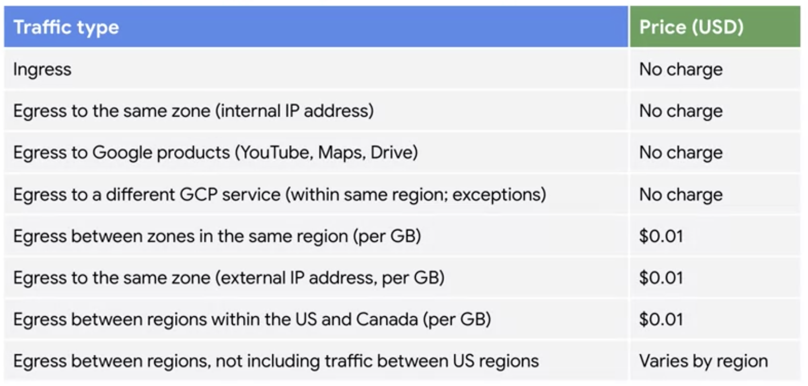
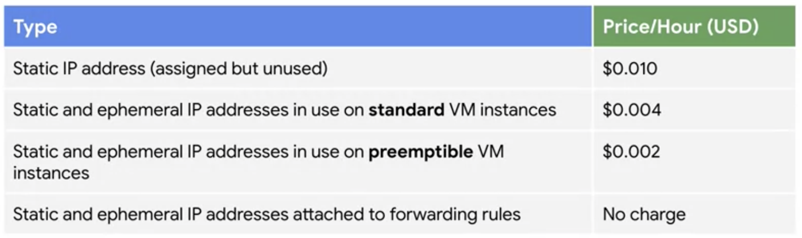
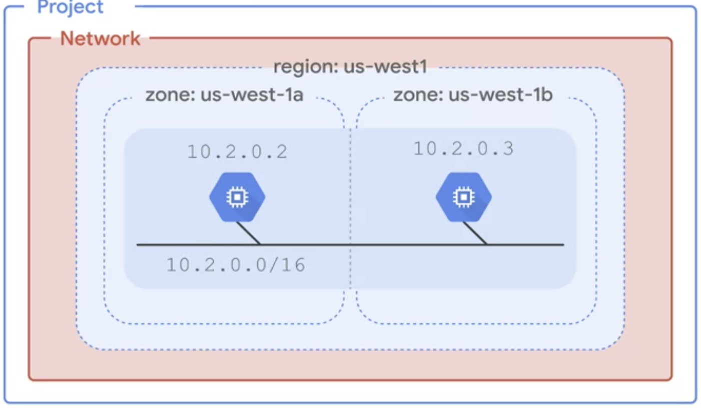
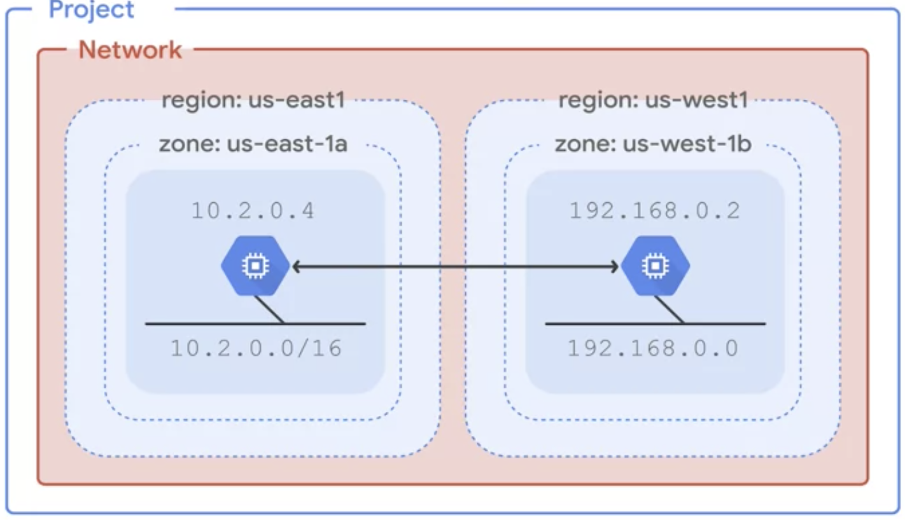
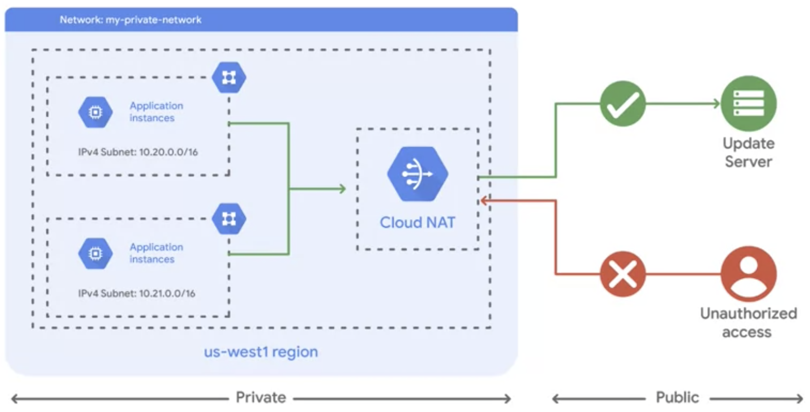
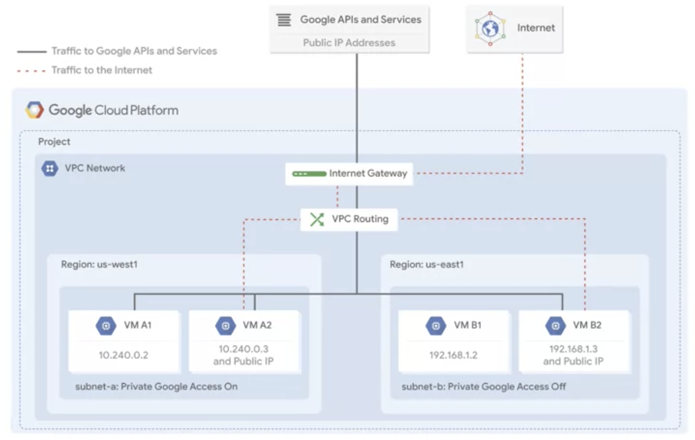
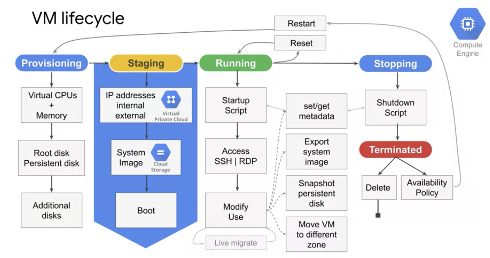
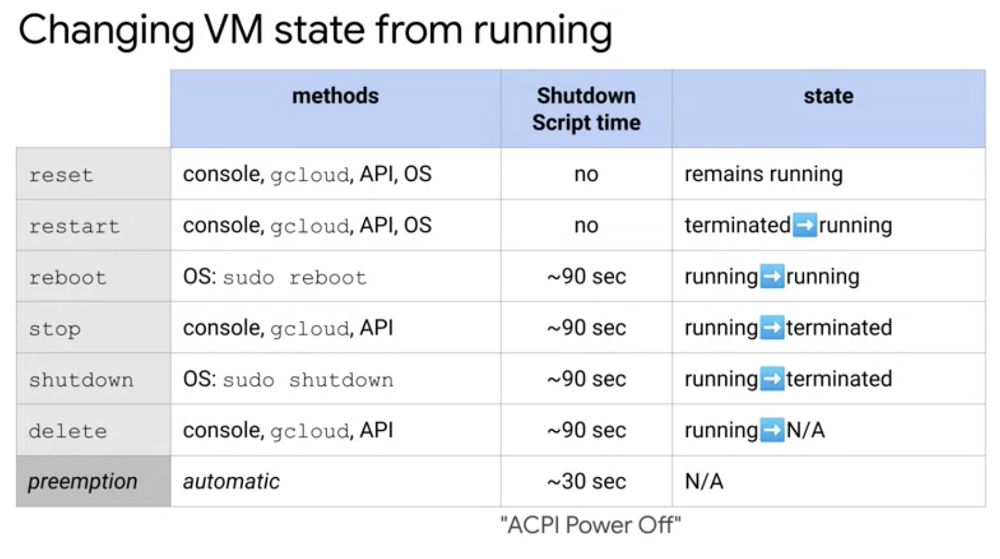

# Essential Google Cloud Infrastructure: Foundation

## Week 1

### Understand how to navigate the course

#### Course Introduction

#### Welcome to Essential Cloud Infrastructure: Foundation

### Overview

#### Module Overview

### Using Google Cloud

#### Using Google Cloud

* Four ways to interact with GCP
    1. Google Cloud Platform Console
    2. Cloud Shell and Cloud SDK
    3. REST-based API
    4. Cloud Mobile App

#### Lab Intro: Console and Cloud Shell

#### Getting Started with Google Cloud Platform and Qwiklabs

#### Lab: Working with GCP Cloud Console and Cloud Shell

* Cloud shell provides the following:
    - Temporary Compute Engine VM
    - Command-line access to the instance via a browser
    - 5 GB of persistent disk storage ($HOME dir)
    - Pre-installed Cloud SDK and other tools
    - **gcloud**: command-line tool for working with Compute Engine and many Google Cloud services
    - **gsutil**: command-line tool for working with Cloud Storage
    - **kubectl**: command-line tool for working with Google Kubernetes Engine and Kubernetes
    - **bq**: command-line tool for working with BigQuery
    - Language support for Java, Go, Python, Node.js, PHP, and Ruby
    - Web preview functionality
    - Built-in authorization for access to resources and instances
* After 1 hour of inactivity, the Cloud Shell instance is recycled. Only the /home directory persists. Any changes made to the system configuration, including environment variables, are lost between sessions.

```
gsutil mb gs://xncjrtlpx2
gsutil cp v.gif gs://xncjrtlpx2

gcloud compute regions list  # list available regions

# storing envvars in config file
mkdir infraclass
touch infraclass/config
INFRACLASS_REGION=us-east4
echo INFRACLASS_REGION=$INFRACLASS_REGION >> ~/infraclass/config
INFRACLASS_PROJECT_ID=qwiklabs-gcp-04-8f89d0dbdea8
echo INFRACLASS_PROJECT_ID=$INFRACLASS_PROJECT_ID >> ~/infraclass/config
source infraclass/config
echo $INFRACLASS_PROJECT_ID

# vim .profile and add line:
#   source infraclass/config
```

#### Lab Review: Console and Cloud Shell

#### Lab Intro: Infrastructure Preview

#### Lab: Infrastructure Preview

* Marketplace: "Jenkins Certified by Bitnami"

#### Lab Review: Infrastructure Preview

#### Demo: Projects

* Resources can only be created and used within Projects
* Project shutdown takes 30 days (in case you change your mind)

```
gcloud config list | grep project  # get current project
gcloud config set project some-project-id
```

### Review

#### Module Quiz

#### Module Review

### Overview

#### Module Overview

* Software defined network, built on a global fiber infrastructure
* Regions have three zones, with the exception of Iowa (USCentral-1), which has four
* PoPs are where Google's network connects to rest of internet

### Virtual Private Cloud

#### Virtual Private Cloud

* Use Virtual Private Cloud to isolate collections of resources

#### Projects, networks, and subnetworks

* **Project**: associate objects and services with billing, and generally have 5 or less networks
* **Networks**:
    - Have no IP ranges; are global and span all regions
    - Contains **subnetworks**, which can cross zones within a region
* Three VPC network types:
    - **Default**: every project comes with this: one subnet per region, default firewall rules
    - **Auto Mode**: default network, with one subnet per region, regional IP allocation, fixed /20 subnetwork per region, expandable up to /16
        - "Default" is actually a type of Auto Mode
    - **Custom Mode**: no default subnets created, full control over IP ranges, expandable to any **RFC 1918** size
* VMs within the same network can communicate using internal IP address, even if in different regions
    - VMs in different networks communicate via internet, even if in same region
    - Note that traffic sent via internet may not be public internet (instead using Google Edge routers), but has different billing and security ramifications
* On prem resources can communicate privately with VPN resources via **VPN Gateway**
* Reserved IP addresses:
    - `10.0.0.0` is reserved for the network
    - `10.0.0.1` is reserved for the VPN Gateway
    - Second to last and last addresses reserved (last is broadcast address)
* Can expand (but not shrink) subnets without re-creating instances
    - Cannot overlap with other subnets within the same VPC
    - Auto Mode can be expanded from /20 to /16, but no larger
    - Avoid large subnets; more likely to lead to CIDR range collisions

#### Demo: Expand a Subnet

#### IP addresses

* VMs can have internal and external IP addresses
* Internal IP addresses use DHCP, the lease of which renews every 24 hours

#### Demo: Internal and external IP

* When creating VM, the internal address can be:
    - ephemeral (automatic)
    - ephemeral (custom)
    - reserve custom static IP address
* When creating VM, the external address can be:
    - none
    - ephemeral
    - static IP address

#### Mapping IP addresses

* External IP is unknown to the OS of the VM
* The external IP is mapped to the internal IP address by VPC
* Every instance has a hostname resolved to internal IP by DNS: `[hostname].[zone].c.[project-id].internal`
* Public DNS records for external addresses are not published automatically
* **Cloud DNS**: Google's DNS service with 100% uptime SLA

#### Routes and firewall rules

* A **route** is a mapping of an IP range to a destination
* Every network has:
    1. routes that let instances inside a network talk to each other
    2. a default route that directs packets to destinations outside the network
* VM Routing table
    - forward traffic to most specific route
* Traffic only delivered if matches firewall rule
    - Firewall rules apply to the network as a whole
    - However, connections allowed or denied at the instance level
    - Firewall rules are stateful
    - Implied deny all ingress, allow all egress

#### Pricing





* **GCP Pricing Calculator**: Google's web-based tool to estimate cost of using GCP resources under different conditions

#### Lab: VPC Networking

In this lab, you create an auto mode VPC network with firewall rules and two VM instances. Then, you convert the auto mode network to a custom mode network and create other custom mode networks as shown in the network diagram below. You also test connectivity across networks.


* The default network has a subnet in each Google Cloud region.
* There is a route for each subnet and one for the Default internet gateway (0.0.0.0/0)
* You can create custom static routes to direct some packets to specific destinations. For example, you can create a route that sends all outbound traffic to an instance configured as a NAT gateway.
* Auto mode network's default rules allow connections between region's internal IP addresses

```
ping -c 3 <ip>  # to ping 3 times
```

* Note pinging internal address took avg of .030ms, whereas pinging external address took average of .572ms

```
# Create VPC network and subnets
gcloud compute networks create privatenet --subnet-mode=custom
gcloud compute networks subnets create privatesubnet-us --network=privatenet --region=us-central1 --range=172.16.0.0/24
gcloud compute networks subnets create privatesubnet-eu --network=privatenet --region=europe-west1 --range=172.20.0.0/20

# Confirm VPC network and subnets
gcloud compute networks list  # list VPC networks
gcloud compute networks subnets list --sort-by=NETWORK

# Add firewall rule(s)
gcloud compute firewall-rules create privatenet-allow-icmp-ssh-rdp --direction=INGRESS --priority=1000 --network=privatenet --action=ALLOW --rules=icmp,tcp:22,tcp:3389 --source-ranges=0.0.0.0/0
gcloud compute firewall-rules list --sort-by=NETWORK

# Create instances
gcloud compute instances create privatenet-us-vm --zone=us-central1-c --machine-type=f1-micro --subnet=privatesubnet-us --image-family=debian-10 --image-project=debian-cloud --boot-disk-size=10GB --boot-disk-type=pd-standard --boot-disk-device-name=privatenet-us-vm
gcloud compute instances list --sort-by=ZONE
```

#### Lab review: VPC Networking

### Common network designs

#### Common network designs

Increased availability:



Globalization with multiple regions:



* Whenever possible, avoid external IP addresses
* **Cloud NAT**: Google's managed network address translation service, which provides internet access to private instances.
    - provides outbound (but not inbound) connections



* You must enable **private Google access** to private subnets if you want to enable instances without public IP addresses to use Google services
    - enabled on a subnet-by-subnet basis
    - anything with a public IP can use Google services regardless



#### Lab Intro: Implement Private Google Access and Cloud NAT

#### Lab: Implement Private Google Access and Cloud NAT

In this lab, you implement Private Google Access and Cloud NAT for a VM instance that doesn't have an external IP address. Then, you verify access to public IP addresses of Google APIs and services and other connections to the internet.

VM instances without external IP addresses are isolated from external networks. Using Cloud NAT, these instances can access the internet for updates and patches, and in some cases, for bootstrapping. As a managed service, Cloud NAT provides high availability without user management and intervention.

```
# Connecting to compute instance without external IP address
gcloud compute ssh <instance-name> --zone us-central1-c --tunnel-through-iap

#
gsutil cp gs://cloud-training/gcpnet/private/access.svg gs://[my_bucket]
gsutil cp gs://[my_bucket]/*.svg .
```

#### Lab Review: Implement Private Google Access and Cloud NAT

### Review

#### Module Quiz

#### Module Review

## Week 2

### Overview

#### Module Overview

### Creating virtual machines

#### Compute Engine

* A **vCPU** is equal to 1 hardware hyper-thread
* Theoretical max of 32 Gbps throughput for an instance with 16 vCPU, or 100 Gbps throughput for T4 or V100 GPUs
* Storage:
    - Standard
    - SSD
    - local SSD
* External SSD up to 64TB
* Performance of disks scales linearly with size

#### Demo: Create a VM

#### VM access and lifecycle





* **live migration**: during maintenance event, VM is migrated to different hardware without interruption
    - alternative is termination; live migration is default

#### Lab Intro: Creating virtual machines

#### Lab: Creating virtual machines

```
free                    # view free memory
sudo dmidecode -t 17    # view installed RAM
nproc                   # view number of processors
lscpu                   # view details of CPUs
```

#### Lab Review: Creating virtual machines

### Working with virtual machines

#### Compute options

* You can create a **custom machine type** (specify memory and number of CPUs), or select a **predefined machine type**:
    - **standard**: for tasks that balance of CPU and memory needs
    - **high memory**: for tasks that require more memory relative to CPUs
    - **high-CPU**: for tasks that require more CPU relative to memory
    - **memory-optimized**: for tasks that require far more memory relative to CPUs
    - **compute-optimized**: for tasks that require far more CPU relative to memory
    - **shared-core**: 1 vCPU that is shared with other applications
        - `f1-micro`: 0.2 vCPUs
        - `g1-small`: 0.5 vCPUs

#### Compute pricing

* Charged minimum of 1 minute, then charged in 1s increments
* Each vCPU and GB of memory billed separately
* Discounts:
    - sustained use: up to 30% net discount for instances running entire month
    - committed use
    - preemptible VM instances
* **Recommendation Engine**: notifies you of underutilized instances

#### Special compute configurations

* Preemptible VMs have no charge for 10min, 30s notification, live up to 24hrs, save up to 80%
* **Sole-tenant nodes**: single host serving single tenant's VMs
* **Shielded VMs**: verified integrity of VMs, including secure boot, virtual trusted platform module, integrity monitoring

#### Images

* What's in an image?
    - boot loader
    - operating system
    - file system structure
    - software
    - customizations
* Images
    - public
        - premium image: charged for use, generally by minute after minimum time
    - custom

#### Disk options

* Book disk can survive instance deletion if uncheck "Delete boot disk when instance is deleted" option
* **Persistent disk**: network storage appearing as a block sized
    - can be dynamically resized
    - can be attached read-only to multiple VMs
    - zonal or regional
* **Local disks**: attached directly to VMs, so ephemeral, but high IOPS
    - Can attach up to 8
    - Survive restart but not deletion of VMs

#### Common Compute Engine actions

* Metadata servers store info about VMs, and used during boot, run, maintenance, shutdown
* Can automatically move instance within region (using `gcloud compute instances move`), but between regions is manual process
* Snapshots
    - Incremental
    - Can be used to load data on new disks
* You can grow disks in size, but you can't shrink them

#### Lab Intro: Working with Virtual Machines

#### Lab: Working with Virtual Machines

In this lab, you set up a game application—a Minecraft server.

The Minecraft server software will run on a Compute Engine instance.

You use an e2-medium machine type that includes a 10-GB boot disk, 2 virtual CPU (vCPU), and 4 GB of RAM. This machine type runs Debian Linux by default.

To make sure there is plenty of room for the Minecraft server's world data, you also attach a high-performance 50-GB persistent solid-state drive (SSD) to the instance. This dedicated Minecraft server can support up to 50 players.

* Note that externals disks are attached to the instance, but they are not automatically mounted or formatted.

```
# Formatting and mounting disk
sudo mkdir -p /home/minecraft
sudo mkfs.ext4 -F -E lazy_itable_init=0,\
lazy_journal_init=0,discard \
/dev/disk/by-id/google-minecraft-disk
sudo mount -o discard,defaults /dev/disk/by-id/google-minecraft-disk /home/minecraft

# Installing JRE and Minecraft server
sudo apt-get update
sudo apt-get install -y default-jre-headless
cd /home/minecraft
sudo apt-get install wget
sudo wget https://launcher.mojang.com/v1/objects/d0d0fe2b1dc6ab4c65554cb734270872b72dadd6/server.jar

# Accept license
sudo vim eula.txt   # edit "false" to "true"

# Create virtual terminal screen
sudo apt-get install -y screen

# Run server
#sudo java -Xmx1024M -Xms1024M -jar server.jar nogui
sudo screen -S mcs java -Xmx1024M -Xms1024M -jar server.jar nogui

# Detach and reattach screen from SSH terminal
# press press Ctrl+A, Ctrl+D to detach
sudo screen -r mcs   # to reattach
```

#### Lab Review: Working with Virtual Machines

### Review

#### Module Quiz

#### Module Review

#### Course Review

#### Next Course: Essential Cloud Infrastructure: Core Services

* "Essential Cloud Infrastructure: Core Services" covers:
    1. Cloud IAM
    2. Data Storage Services
    3. Resource Management
    4. Resource Monitoring

## Misc (non-course but related information)

### [RFC-1918: Address Allocation for Private Internets](https://datatracker.ietf.org/doc/html/rfc1918) - Feb 1996

#### 1. Introduction

* Describes address allocation for private internets, which may or may not map to public internet

#### 2. Motivation

* The cost of using private internet address space is the potentially costly effort to renumber hosts and networks between public and private
* Concerns:
    - Exponential growth of internet is the concern that the globally unique address space will be exhausted
    - More pressing: amount of routing overhead will grow beyond capabilities of ISPs
* To contain growth of routing overhead, an Internet Provider obtains a block of address space from an address registry, and then assigns to its customers addresses from within that block based on each customer requirement. The result of this process is that routes to many customers will be aggregated together, and will appear to other providers as a single route [RFC1518], [RFC1519].
* Hosts within enterprises that use IP can be partitioned into three categories:
    1. (Private) hosts that do not require access to hosts in other enterprises or the Internet at large; hosts within this category may use IP addresses that are unambiguous within an enterprise, but may be ambiguous between enterprises.
    2. (Private) hosts that need access to a limited set of outside services (e.g., E-mail, FTP, netnews, remote login) which can be handled by mediating gateways (e.g., application layer gateways). Just like hosts within the first category, such hosts may use IP addresses that are unambiguous within an enterprise, but may be ambiguous between enterprises.
    3. (Public) hosts that need network layer access outside the enterprise (provided via IP connectivity); hosts in the last category require IP addresses that are globally unambiguous.

#### 3. Private Address Space

* Internet Assigned Numbers Authority (IANA) has reserved the following three blocks of the IP address space for private internets:

| Name | Range | Prefix |
| ---- | ----- | ------ |
| 24-bit block | 10.0.0.0 - 10.255.255.255 | /8 prefix |
| 20-bit block | 172.16.0.0 - 172.31.255.255 | /12 prefix |
| 16-bit block | 192.168.0.0 - 192.168.255.255 | /16 prefix |

* An enterprise that decides to use IP addresses out of the address space defined in this document can do so without any coordination with IANA or an Internet registry
* While not having external (outside of the enterprise) IP connectivity private hosts can still have access to external services via mediating gateways (e.g., application layer gateways).

#### 4. Advantages and Disadvantages of Using Private Address Space

#### 5. Operational Considerations

* One possible strategy is to design the private part of the network first and use private address space for all internal links. Then plan public subnets at the locations needed and design the external connectivity.
* If a suitable subnetting scheme can be designed and is supported by the equipment concerned, it is advisable to use the 24-bit block (class A network) of private address space and make an addressing plan with a good growth path.
    - If subnetting is a problem, the 16-bit block (class C networks), or the 20-bit block (class B networks) of private address space can be used.

### [Understand TCP/IP addressing and subnetting basics](https://docs.microsoft.com/en-us/troubleshoot/windows-client/networking/tcpip-addressing-and-subnetting)

#### Summary

* A **subnet mask** is used to divide an IP address into two parts: one part identifies the host, the other part identifies the network to which it belongs

#### IP addresses: Networks and hosts

* An IP address is a 32-bit number usually expressed in the **dotted-decimal format** (e.g., 192.168.123.132), with each 8-bit section known as an **octet**
* For a TCP/IP **wide area network** (**WAN**) to work efficiently as a collection of networks, the routers that pass packets of data between networks don't know the exact location of a host for which a packet of information is destined

#### Subnet mask

* RFC 1878 describes the valid subnets and subnet masks that can be used on TCP/IP networks

#### Network classes

* Internet addresses are allocated by the **InterNIC**, the organization that administers the Internet
* Most IP addresses divided into three classes:
    - **Class A networks**: use a default subnet mask of 255.0.0.0 and have 0-127 as their first octet
    - **Class B networks**: use a default subnet mask of 255.255.0.0 and have 128-191 as their first octet.
    - **Class C networks**: use a default subnet mask of 255.255.255.0 and have 192-223 as their first octet.

#### Subnetting

* Subnetting becomes necessary as you reconcile the logical address scheme of the Internet (the abstract world of IP addresses and subnets) with the physical networks in use by the real world.
    - E.g., say you have 150 computers are on three separate physical networks in different cities. Instead of requesting more address blocks for each network, you divide your network into subnets that enable you to use one block of addresses on multiple physical networks.
* Essentially, subnetting is 'borrowing' some of the bits used for the host address, and using them for the network portion of the address
* E.g., using a subnet mask of 255.255.255.192, your 192.168.123.0 network then becomes the four networks: 192.168.123.0, 192.168.123.64, 192.168.123.128 and 192.168.123.192

#### Default Gateways
* If a TCP/IP computer needs to communicate with a host on another network, it will usually communicate through a device called a **router**
* A router that is specified on a host, which links the host's subnet to other networks, is called a **default gateway**
* When a host attempts to communicate with another device using TCP/IP, it performs a comparison process using the defined subnet mask and the destination IP address versus the subnet mask and its own IP address. The result of this comparison tells the computer whether the destination is a local host or a remote host.

#### References

* "TCP/IP Illustrated, Volume 1: The Protocols," Richard Stevens, Addison Wesley, 1994
* "Internetworking with TCP/IP, Volume 1: Principles, Protocols, and Architecture," Douglas E. Comer, Prentice Hall, 1995

#### Troubleshooting

### [VPC network overview](https://cloud.google.com/vpc/docs/vpc)

* **Virtual Private Cloud** (**VPC**) network is a virtual version of a physical network, implemented using **Andromeda** for cloud network virtualization
* VPCs provide connectivity for your Compute Engine virtual machine (VM) instances, including Google Kubernetes Engine (GKE) clusters, App Engine flexible environment instances, and other Google Cloud products built on Compute Engine VMs
* New projects start with a default network (an auto mode VPC network) that has one subnetwork (subnet) in each region

#### Specifications

* VPCs are global resources, whereas subnets are regional resources
* An organization can use Shared VPC to keep a VPC network in a common host project
* VPC networks can be connected to other VPC networks in different projects or organizations by using **VPC Network Peering**.

#### Networks and subnets

* VPC networks do not have any IP address ranges associated with them; IP ranges are defined for the subnets.
* A network must have at least one subnet before you can use it.
* Auto mode VPC networks create subnets in each region automatically.
* Custom mode VPC networks start with no subnets, giving you full control over subnet creation.
* When you create a resource in Google Cloud, you choose a network and subnet.

#### Subnet creation mode

* When an auto mode VPC network is created, one subnet from each region is automatically created within it.
    - These automatically created subnets use a set of predefined IP ranges that fit within the 10.128.0.0/9 CIDR block.
    - You can add more subnets manually to auto mode VPC networks in regions that you choose by using IP ranges outside of 10.128.0.0/9.
* You can switch a VPC network from auto mode to custom mode.
    - This is a one-way conversion; custom mode VPC networks cannot be changed to auto mode VPC networks.

#### Considerations for auto mode VPC networks

* Because the subnets of every auto mode VPC network use the same predefined range of IP addresses, you cannot connect auto mode VPC networks to one another.

#### Subnet ranges

* The primary internal addresses for the following resources come from the subnet's **primary IP address range**: VM instances, internal load balancers, and internal protocol forwarding.
* You can optionally add **secondary IP address ranges** to a subnet, which are only used by alias IP ranges.
* Here's a [list of valid IP address ranges](https://cloud.google.com/vpc/docs/vpc#valid-ranges).

#### IPv6 addresses

* You can enable external IPv6 on supported subnets.
* Connecting to Google APIs and services using external IPv6 addresses is currently not supported.

#### Routes and firewall rules

**_LEFT OFF HERE_**

### [RFC-1518: An Architecture for IP Address Allocation with CIDR](https://datatracker.ietf.org/doc/html/rfc1518)

### [RFC-1519: Classless Inter-Domain Routing (CIDR): an Address Assignment and Aggregation Strategy](https://datatracker.ietf.org/doc/html/rfc1519)

### [RFC-1878: Variable Length Subnet Table For IPv4](https://datatracker.ietf.org/doc/html/rfc1878)

* Describes the valid subnets and subnet masks that can be used on TCP/IP networks

### [Andromeda: Performance, Isolation, and Velocity at Scale in Cloud Network Virtualization](https://www.usenix.org/system/files/conference/nsdi18/nsdi18-dalton.pdf)
