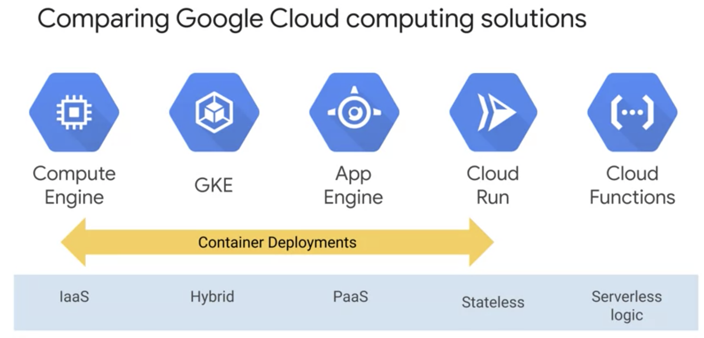
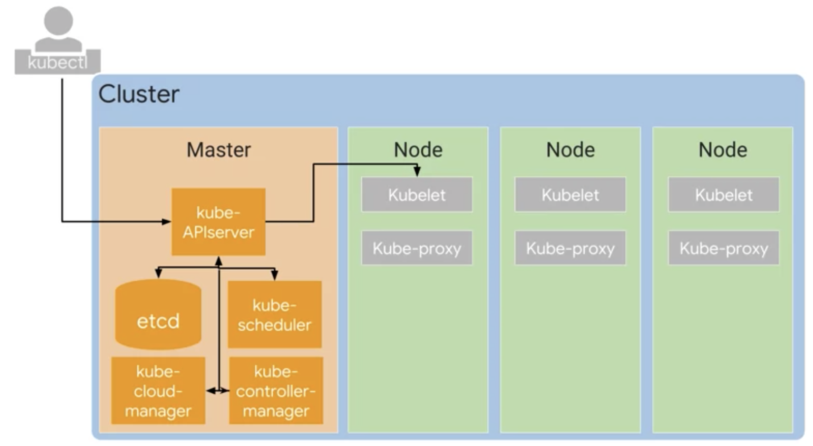
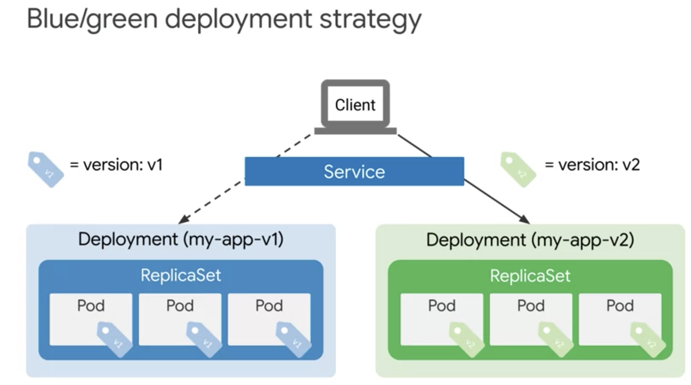

# MLOps (Machine Learning Operations) Fundamentals

## Week 1

### Welcome to the course

#### Course Introduction

### Why and When to Employ MLOps

#### Data Scientists’ Pain Points

* Reproducibility is a major concern for data scientists

* We borrow the ideas from DevOps, and apply them to ML -> MLOps

#### Machine Learning Lifecycle

* **MLOps** is a lifecycle management discipline for machine learning

* Some DevOps concepts translate directly to MLOps:
    - Continuous Integration (CI): merging code frequently
    - Continuous Delivery (CD): releasing code frequently
    - **Continuous Training** (**CT**): Monitor -> Measure -> Retrain -> Serve

* MLOps differs from DevOps in significant ways:
    - Also test and validate data, data schemas, and models
    - Consider whole system (the entire pipeline), not individual software package
    - Must constantly monitor, retrain, and serve the model

* Machine learning is the high-interest credit card of technical debt

* ML systems easily build up technical debt:
    - multi-functional teams
    - experimental nature (and tracking what worked, and providing reproducibility)
    - testing complexity
    - deployment complexity
    - **model decay**: the predictive power of model degrades as data drifts

#### MLOps Architecture and TensorFlow Extended Components

* Phases of a machine learning project
    1. Discovery phase
        1. Define business use case
        1. Data exploration
        1. Select algorithm
    1. Development phase
        1. Data pipeline and feature engineering
        1. Build ML model
        1. Evaluate
        1. Present results
    1. Deployment phase
        1. Plan for deployment
        1. Operationalize model
        1. Monitor model


### Quiz

#### Why and When to Employ MLOps

### Introduction to Containers and Kubernetes

#### Introduction

#### Introduction to Containers

* **Containers**: isolated user spaces for running application code

#### Containers and Container Images

* **(Container) Image**: application and its dependencies

* **Container**: running instance of image

* We'll use Cloud Build to create Docker-formatted container images

* Docker uses **Linux namespaces** to control what an application can see, **cgroups** to control resource access, and **Union file systems**

* When writing a Dockerfile, start with lines least likely to change through to lines most likely to change

* Today, it's a best practice to not include build steps in final container; instead, used staged approach when one container used to create another

* **Container Layer**: thin, ephemeral read/write layer on top of the union file system, where container can make changes

* **gcr.io**: Google's container registry, providing both private and public container images

* **Cloud Build**: Google's managed build (including container images), test, and deploy service

#### Practice Quiz: Containers and Container Images

#### Lab Intro

#### Qwiklabs – Working with Cloud Build

quickstart.sh:
```
#!/bin/sh
echo "Hello, world! The time is $(date)."
```

Dockerfile:
```
FROM alpine
COPY quickstart.sh /
CMD ["/quickstart.sh"]
```

Cloud Shell:
```
# manual build
$ gcloud builds submit --tag gcr.io/${GOOGLE_CLOUD_PROJECT}/quickstart-image .

# same thing, but using configuration
$ git clone https://github.com/GoogleCloudPlatform/training-data-analyst
$ ln -s ~/training-data-analyst/courses/ak8s/v1.1 ~/ak8s
$ cd ~/ak8s/Cloud_Build/a
$ gcloud builds submit --config cloudbuild.yaml .

#
$ cd ~/ak8s/Cloud_Build/b
$ gcloud builds submit --config cloudbuild.yaml .
```

#### Lab solution

#### Introduction to Kubernetes

#### Introduction to Google Kubernetes Engine

* GKE features:
    - fully managed
    - container-optimized OS
    - auto upgrade k8s
    - auto repair (health checks node, gracefully reduces load and rebuilds)
    - cluster scaling
    - seamless integration with Google Cloud Build, Container Registry
    - IAM
    - Integrated logging and monitoring

#### Introduction to Google Kubernetes Engine

#### Compute Options Detail



#### Practice Quiz: Containers and Kubernetes in Google Cloud

### Kubernetes Architecture

#### Kubernetes Concepts

* Two important k8s concepts:
    - Kubernetes Object Model
    - Principle of declarative management

* **Kubernetes objects**: persistent entities representing the state of the cluster
    - Object spec
    - Object status
* **Pods**: basic building block, and smallest deployable unit
    - Not self-healing
* The **Kubernetes Control Plane** reconciles current state with desired state

#### Practice Quiz: Kubernetes Concepts

#### The Kubernetes Control Plane



#### Practice Quiz: The Kubernetes Control Plane

#### Google Kubernetes Engine Concepts

* **Node pool**: set of pods on GKE that share configuration
* GKE zonal and regional clusters
* By default, regional clusters spread across 3 zones, each with its own master and nodes
* Private clusters still accessible by GCP by private IP, as well as **authorized networks** (trusted IP ranges) by external IP

#### Practice Quiz: Google Kubernetes Engine Concepts

#### Lab Intro

#### Qwiklabs - Deploying Google Kubernetes Engine

#### Video: Lab solution

### Deployments and Jobs

#### Deployments

* **Deployments**: used to declare a desired deployed state of pods.
    - Well suited for stateless application (e.g., web frontend)
* **ReplicaSet**: used to ensure a specified number of pods is running at a given time.
* Deployments have three states:
    - Progressing State
    - Complete State
    - Failed State

#### Ways to Create Deployments

* Three ways to create deployment
    1. Declaratively: `kubectl apply -f [MANIFEST_NAME]`
    2. Imperatively: `kubectl run [NAME] [PARAMS ...]`
    3. GKE console

* Inpecting deployments:
    1. Using kubectl
    ```
    kubectl get deployment [NAME]
    kubectl get deployment [NAME] -o yaml > foo.yaml
    ```
    2. Using GKE console

#### Services and Scaling

* Manually scaling deployment
    1. Declaratively, after changing manifest file: `kubectl apply -f [MANIFEST_NAME]`
    2. Imperatively: `kubectl scale deployment [NAME] --replicas=5`
    3. Using GKE console
* Autoscaling deployments:
    1. Declaratively, using `HorizontalPodAutoscaler`
    2. Imperatively, using `kubectl autoscale deployment ...`
    3. Using GKE console
* **Thrashing**: frequent fluctuations in autoscaling. Mitigated or prevented with cooldown or delay.

#### Practice Quiz: Deployments

#### Updating Deployments

#### Rolling Updates

* "Max unavailable" field
    - Default: 25%
* "Max surge" field limits maximum number of pods, based on desired number of pods
    - Default: 25%

#### Blue-Green Deployments

* "Recreate" strategy deleted pods before creating new ones
* **Services** encapsulate pods



#### Canary Deployments

* Rollback: `kubectl rollout undo deployment [DEPLOYMENT_NAME]`

#### Practice Quiz: Updating deployments

#### Managing Deployments

* May have problems if too many frequent changes, causing frequent rollouts
* To pause rollouts:
    ```
    kubectl rollout pause deployment [NAME]
    kubectl rollout resume deployment [NAME]
    kubectl rollout status deployment [NAME]
    kubectl delete deployment [NAME]
    ```

#### Lab Intro

####

## Week 2

## Week 3
