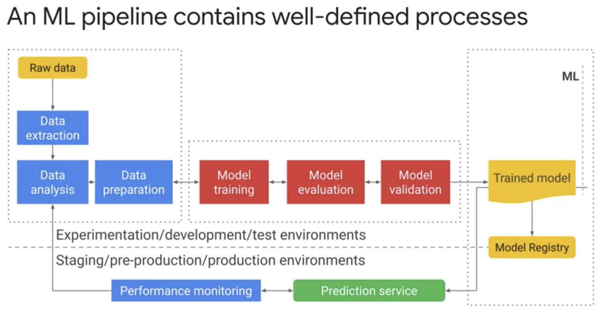
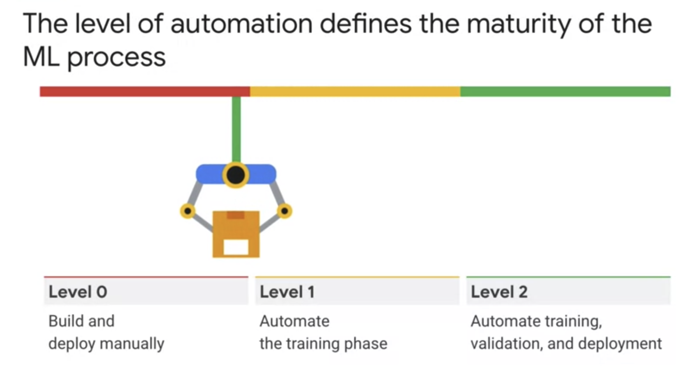

# MLOps (Machine Learning Operations) Fundamentals

## Week 1

### Welcome to the course

#### Course Introduction

### Why and When to Employ MLOps

#### Data Scientists’ Pain Points

* Reproducibility is a major concern for data scientists

* We borrow the ideas from DevOps, and apply them to ML -> MLOps

#### Machine Learning Lifecycle

* **MLOps** is a lifecycle management discipline for machine learning

* Some DevOps concepts translate directly to MLOps:
    - Continuous Integration (CI): merging code frequently
    - Continuous Delivery (CD): releasing code frequently
    - **Continuous Training** (**CT**): Monitor -> Measure -> Retrain -> Serve

* MLOps differs from DevOps in significant ways:
    - Also test and validate data, data schemas, and models
    - Consider whole system (the entire pipeline), not individual software package
    - Must constantly monitor, retrain, and serve the model

* Machine learning is the high-interest credit card of technical debt

* ML systems easily build up technical debt:
    - multi-functional teams
    - experimental nature (and tracking what worked, and providing reproducibility)
    - testing complexity
    - deployment complexity
    - **model decay**: the predictive power of model degrades as data drifts

#### MLOps Architecture and TensorFlow Extended Components

* Phases of a machine learning project
    1. Discovery phase
        1. Define business use case
        1. Data exploration
        1. Select algorithm
    1. Development phase
        1. Data pipeline and feature engineering
        1. Build ML model
        1. Evaluate
        1. Present results
    1. Deployment phase
        1. Plan for deployment
        1. Operationalize model
        1. Monitor model

### Quiz

#### Why and When to Employ MLOps

### Introduction to Containers and Kubernetes

#### Introduction

#### Introduction to Containers

* **Containers**: isolated user spaces for running application code

#### Containers and Container Images

* **(Container) Image**: application and its dependencies

* **Container**: running instance of image

* We'll use Cloud Build to create Docker-formatted container images

* Docker uses **Linux namespaces** to control what an application can see, **cgroups** to control resource access, and **Union file systems**

* When writing a Dockerfile, start with lines least likely to change through to lines most likely to change

* Today, it's a best practice to not include build steps in final container; instead, used staged approach when one container used to create another

* **Container Layer**: thin, ephemeral read/write layer on top of the union file system, where container can make changes

* **gcr.io**: Google's container registry, providing both private and public container images

* **Cloud Build**: Google's managed build (including container images), test, and deploy service

#### Practice Quiz: Containers and Container Images

#### Lab Intro

#### Qwiklabs – Working with Cloud Build

#### Lab solution

#### Introduction to Kubernetes

## Week 2

## Week 3
