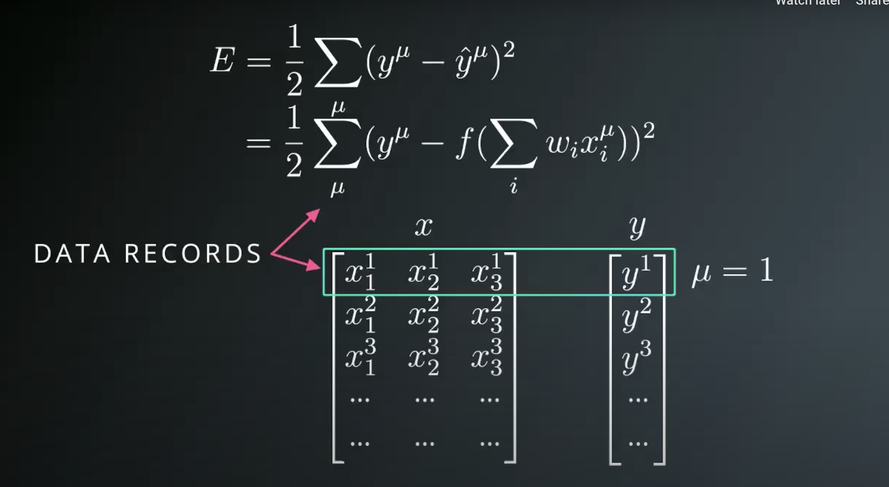
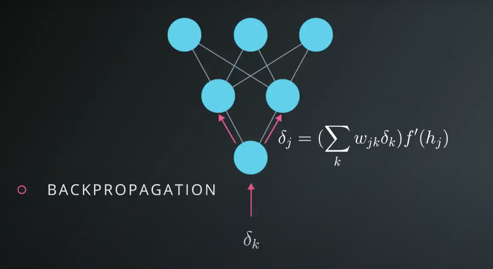
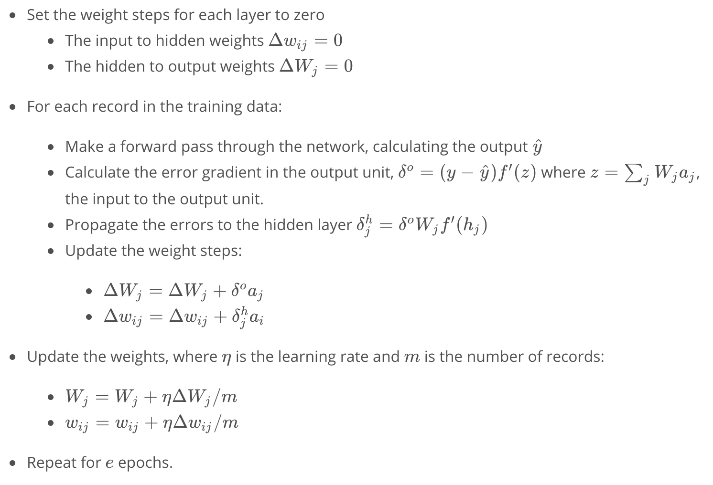

# Implementing Gradient Descent

## 1. Mean Squared Error Function

## 2. Gradient Descent

* **Sum of Squared Errors** (**SSE**): E = 1/2 ∑[yⱼ - ŷⱼ]²
    

* Updating our weights:`wᵢ = wᵢ + Δwᵢ` (or `wᵢ′ <- wᵢ + Δwᵢ`)
    - The weight step: `Δwᵢ`
    - The gradient: `∂E/∂wᵢ`
    - Note that the weight step is proportional to the gradient: `Δwᵢ ∝ ∂E/∂wᵢ`
    - `Δwᵢ = -η ∂E/∂wᵢ`, where **η** (small letter eta) is the learning rate
    - `∂E/∂wᵢ = -(y-ŷ) * ƒ′(h) * xᵢ`. Derivation:
        ```
        Given: E = 1/2 ∑[y - ŷ]²

        ∂E/∂wᵢ = ∂/∂wᵢ 1/2 (y - ŷ)²                 by definition

        Note: 1/2 (y - ŷ)² = 1/2 (y - fn(wᵢ))²      because ŷ is a function of wᵢ
                           = p(q(wᵢ))
        Where q(wᵢ) = (y - fn(wᵢ)) and p = 1/2 q(wᵢ)²

        ∂E/∂wᵢ = ∂p/∂q 1/2(y-ŷ)² * ∂q/∂wᵢ (y-ŷ)     using chain rule
               = (y-ŷ) * ∂/∂wᵢ (y-ŷ)                apply partial derivative
               = -(y-ŷ) * ∂ŷ/∂wᵢ                    using chain rule (again)
               = -(y-ŷ) * ƒ′(h) ∂/∂wᵢ ∑ wᵢxᵢ        solving for ∂ŷ/∂wᵢ

        Note: ∂/∂w₁ ∑ wᵢxᵢ = ∂/∂w₁[w₁x₁ + w₂x₂ + ... + wᵢxᵢ]
                           = x₁ + 0 + ... + 0
                           = x₁

        Hence: ∂/∂wᵢ ∑ wᵢxᵢ = xᵢ

        ∂E/∂wᵢ = -(y-ŷ) * ƒ′(h) ∂/∂wᵢ ∑ wᵢxᵢ
               = -(y-ŷ) * ƒ′(h) * xᵢ
        ```
    - Hence, `Δwᵢ = η (y-ŷ) ƒ′(h) xᵢ`
    - To make things "easier", define an "error term", **δ** (small letter delta): `δ = (y - ŷ) ƒ′(h)`,
    - So our weight update becomes `wᵢ = wᵢ + η δ xᵢ``

## 3. Gradient Descent: The Math

## 4. Gradient Descent: The Code

* Implementing single step of gradient descent for a neural network _without_ a hidden layer:
    ```python
    import numpy as np

    def sigmoid(x):
        return 1/(1+np.exp(-x))

    def sigmoid_prime(x):
        return sigmoid(x) * (1 - sigmoid(x))

    learn_rate = 0.5
    x = np.array([1, 2, 3, 4])
    y = np.array(0.5)

    # Initial weights
    w = np.array([0.5, -0.5, 0.3, 0.1])

    # h = ∑wᵢxᵢ
    h = np.dot(x, w)

    # ŷ = σ(Wx + b)
    ŷ = sigmoid(h)

    # δ = (y - ŷ) ƒ′(h)
    error_term = y - ŷ * sigmoid_prime(h)

    # wᵢ = wᵢ + η δ xᵢ
    del_w = learn_rate * error_term * x

    print('Neural Network output:')
    print(nn_output)
    print('Amount of Error:')
    print(error)
    print('Change in Weights:')
    print(del_w)
    ```

## 5. Implementing Gradient Descent

* Gradient descent algorithm:
    1. Set the weight step to zero: Δwᵢ = 0
    2. For each record in the training data:
        1. Make a forward pass through the network, calculating the output ŷ = f(∑ wᵢxᵢ)
        2. Calculate the error term for the output unit, δ = (y - ŷ) * ƒ′(∑ wᵢxᵢ)
        3. Update the weight step Δwᵢ = Δwᵢ + δxᵢ
    4. Update the weights w = w + η Δw/m, where η is the learning rate and m is the number of records
    5. Repeat for e epochs.

* Recall sigmoid σ(x) = 1/(1+e⁻ˣ) and σ′(x) = σ(x) (1 - σ(x))

* Need to initialize weights randomly to break symmetry
    - we'll initialize using normal distribution centered at 0
    - we'll scale at 1/√n, where n is the number of input units
    ```python
    weights = np.random.normal(scale=1/n_features**.5, size=n_features)
    ```

* Implementing a neural network _without_ a hidden layer:
    ```python
    import numpy as np
    from data_prep import features, targets, features_test, targets_test

    def sigmoid(x):
        return 1 / (1 + np.exp(-x))

    np.random.seed(42)

    n_records, n_features = features.shape
    last_loss = None

    # initialize weights
    weights = np.random.normal(scale=1 / n_features**.5, size=n_features)

    # hyperparameters
    epochs = 1000
    learn_rate = 0.5

    for e in range(epochs):
        del_w = np.zeros(weights.shape)

        # find Δwᵢ
        for x, y in zip(features.values, targets):
            # ŷ = σ(Wx + b)
            output = sigmoid(np.dot(x, weights))

            # δᵢ = (yᵢ - ŷᵢ) ƒ′(hᵢ)
            # ƒ′(hᵢ) = σ(x) (1 - σ(x))
            error_term = y - output * output * (1 - output)

            # Δwᵢ = Δwᵢ + δᵢ xᵢ
            del_w += error_term * x

        # w = w + η Δw/m
        weights += learn_rate * del_w / n_records

        # Printing out the mean square error on the training set
        if e % (epochs / 10) == 0:
            # ŷ = σ(Wx + b)
            out = sigmoid(np.dot(features, weights))

            # E = 1/2 ∑[yⱼ - ŷⱼ]²
            loss = np.mean((out - targets) ** 2)

            if last_loss and last_loss < loss:
                print("Train loss: ", loss, "  WARNING - Loss Increasing")
            else:
                print("Train loss: ", loss)
            last_loss = loss

    # ŷ = σ(Wx + b)
    test_out = sigmoid(np.dot(features_test, weights))
    predictions = test_out > 0.5
    accuracy = np.mean(predictions == targets_test)
    print("Prediction accuracy: {:.3f}".format(accuracy))
    ```

## 6. Multilayer Perceptrons

* `wᵢⱼ`, where `ᵢ` denotes the input unit and `ⱼ` denotes the hidden unit
    
* Weights now need to be stored in a matrix instead of an array:
    
* Initializing weights using NumPy:
    ```python
    n_records, n_inputs = features.shape
    n_hidden = 2
    weights_input_to_hidden = np.random.normal(0, n_inputs**-0.5, size=(n_inputs, n_hidden))
    ```
* We use matrix multiplication (dot product) to find `hⱼ`:
    
    ```python
    hidden_inputs = np.dot(inputs, weights_input_to_hidden)
    ```
* By default, NumPy arrays are **row vectors** (1xn), but sometimes you want a **column vector** (nx1).
    - To transpose a one-dimensional array, use `arr[:, None]` or `np.array(features, ndmin=2).T`
    - To transpose a multi-dimensional array, use `arr.T`
* Implementing feedforward in a multilayer perceptron:
    ```python
    import numpy as np

    def sigmoid(x):
        return 1/(1+np.exp(-x))

    # Network size
    N_input = 4
    N_hidden = 3
    N_output = 2

    np.random.seed(42)

    # fake input data
    X = np.random.randn(4)

    # initialize weights
    weights_input_to_hidden = np.random.normal(0, scale=0.1, size=(N_input, N_hidden))
    weights_hidden_to_output = np.random.normal(0, scale=0.1, size=(N_hidden, N_output))

    hidden_layer_in = np.dot(X, weights_input_to_hidden)
    hidden_layer_out = sigmoid(hidden_layer_in)

    output_layer_in = np.dot(hidden_layer_out, weights_hidden_to_output)
    output_layer_out = sigmoid(output_layer_in)
    ```

## 7. Backpropagation

* With backpropagation, think of the error as the input, and just going through the network in reverse
    - error resulting from units is also scaled by the weights, just like the signal
    
* Calculating the weight step for hidden nodes:
    
    

* Calculating the weight step for the output node:
    

* **vanishing gradient problem**: when using backpropagation with deep neural networks, weights steps increasingly shrink closer to the inputs

* Implementation for hidden layer with one node:
    ```python
    import numpy as np

    def sigmoid(x):
        return 1 / (1 + np.exp(-x))

    x = np.array([0.5, 0.1, -0.2])
    target = 0.6
    learnrate = 0.5

    weights_input_hidden = np.array([[0.5, -0.6],
                                     [0.1, -0.2],
                                     [0.1, 0.7]])

    weights_hidden_output = np.array([0.1, -0.3])

    ## forward propagation
    hidden_layer_input = np.dot(x, weights_input_hidden)
    hidden_layer_output = sigmoid(hidden_layer_input)

    output_layer_in = np.dot(hidden_layer_output, weights_hidden_output)
    output = sigmoid(output_layer_in)

    ## Backwards propagation
    # error = y - ŷ
    error = target - output
    print('{} - {} = {}'.format(target, output, error))

    # δⁿ = (y - ŷ) ƒ′(h)
    #    = (y - ŷ) * f(h) * (1 - f(h))
    output_error_term = error * output * (1 - output)
    print('{} * {} * (1 - {}) = {}'.format(error, output, output, output_error_term))

    # δⁱ = ∑ W δⁿ f′(h)
    hidden_error_term = np.dot(weights_hidden_output, output_error_term) * hidden_layer_output * (1 - hidden_layer_output)

    # Calculate change in weights for hidden layer to output layer
    # Δw = η δ x
    delta_w_h_o = learnrate * output_error_term * hidden_layer_output

    # Calculate change in weights for input layer to hidden layer
    # Δw = η δ x
    delta_w_i_h = learnrate * hidden_error_term * x[:, None]

    print('Change in weights for hidden layer to output layer:')
    print(delta_w_h_o)
    print('Change in weights for input layer to hidden layer:')
    print(delta_w_i_h)
    ```

## 8. Implementing Backpropagationß

* Algorithm for backpropagation with one hidden layer and one output unit:
    
    ```python
    import numpy as np
    from data_prep import features, targets, features_test, targets_test

    np.random.seed(21)

    def sigmoid(x):
        return 1 / (1 + np.exp(-x))

    # hyperparameters
    n_hidden = 2  # number of hidden units
    epochs = 900
    learn_rate = 0.005

    n_records, n_features = features.shape
    last_loss = None

    # initialize weights
    weights_input_hidden = np.random.normal(scale=1 / n_features ** .5,
                                            size=(n_features, n_hidden))
    weights_hidden_output = np.random.normal(scale=1 / n_features ** .5,
                                             size=n_hidden)

    for e in range(epochs):
        del_w_input_hidden = np.zeros(weights_input_hidden.shape)
        del_w_hidden_output = np.zeros(weights_hidden_output.shape)
        for x, y in zip(features.values, targets):

            ## Forward pass
            hidden_input = np.dot(x, weights_input_hidden)
            hidden_output = sigmoid(hidden_input)
            output = sigmoid(np.dot(hidden_output, weights_hidden_output))

            ## Backward pass
            # error = y - ŷ
            error = y - output

            # output layer error
            # δⁿ = (y - ŷ) ƒ′(h)
            #    = (y - ŷ) * f(h) * (1 - f(h))
            output_error_term = error * output * (1 - output)

            # hidden layer error
            # δⁱ = ∑ W δⁿ f′(h)
            hidden_error_term = np.dot(weights_hidden_output, output_error_term) * hidden_output * (1 - hidden_output)

            # update the change in weights
            # Δw = Δw + δ a
            del_w_hidden_output += output_error_term * hidden_output
            del_w_input_hidden += hidden_error_term * x[:, None]

        # update weights
        # w = w + η Δw / m
        weights_input_hidden += learn_rate * del_w_input_hidden / n_records
        weights_hidden_output += learn_rate * del_w_hidden_output / n_records

        # Printing out the mean square error on the training set
        if e % (epochs / 10) == 0:
            hidden_output = sigmoid(np.dot(x, weights_input_hidden))
            out = sigmoid(np.dot(hidden_output,
                                 weights_hidden_output))
            loss = np.mean((out - targets) ** 2)

            if last_loss and last_loss < loss:
                print("Train loss: ", loss, "  WARNING - Loss Increasing")
            else:
                print("Train loss: ", loss)
            last_loss = loss

    # calculate accuracy
    hidden = sigmoid(np.dot(features_test, weights_input_hidden))
    out = sigmoid(np.dot(hidden, weights_hidden_output))
    predictions = out > 0.5
    accuracy = np.mean(predictions == targets_test)
    print("Prediction accuracy: {:.3f}".format(accuracy))
    ```

## 9. Further Reading
