# Introduction to Neural Networks

## 1 - Instructor

## 2 - Introduction

* Deep learning use cases
  1. AlphaGo and other game playing
  1. Expert systems, sometimes outperforming exports (e.g., doctors)
  1. Self-driving cars

## Lessons 3 - 7, 9 - 11
See: [Perceptron notes](../supervised-learning/perceptron)

## 8 - Why neural networks?

## 12 - Non-linear Regions

* Current perceptron algorithm only works for linearly separable problems

## 13 - Error functions

## 14 - Log-loss Error Function

* E.g., with gradient descent of a mountain, your error would be your height on the mountain

* If our error function is discrete, it can get stuck, as multiple options may have same error value

* Hence, we don't want our error function to be the number of misclassified points

* To apply gradient descent, function should be continuous and differentiable

## 15 - Discrete vs Continuous

* Activation function:
    - Should be continuous function (e.g., sigmoid) instead of discrete (e.g., step function)
    - This means that _every_ point has a probability of being correct

* **sigmoid function**: σ(x) = 1/(1+e⁻ˣ)

* Basically, our perceptron takes `W` and `b` (just like before), and generate a value that we feed into the sigmoid function:

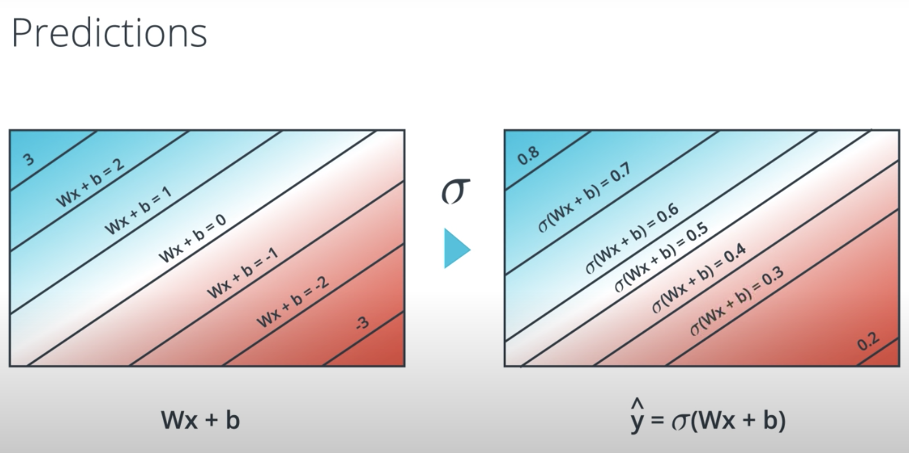

* So our activation function for the second perceptron is the sigmoid function:

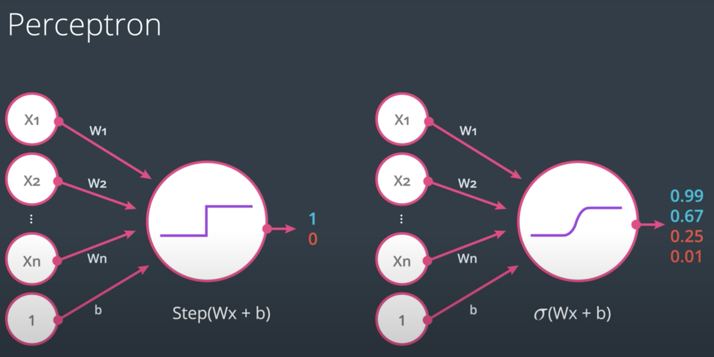

* Quiz: If the score is defined by 4x₁ + 5x₂ - 9 = score, then which of the following points has exactly a 50% probability of being blue or red?

```
[✓] (1,1)
[x] (2,4)
[x] (5,-5)
[✓] (-4,5)

We want to choose everything where 4x₁ + 5x₂ - 9 = 0, given σ(x=0) = 1/(1+e⁰) = 1/2.
```

# 16 - Softmax

* **Softmax function**: P(classᵢ) = e^Zᵢ / ∑ e^Zⱼ for all scores in Z. Functions as a multi-class sigmoid.

```python
import numpy as np
from math import exp

def softmax(Z):
    calc = lambda a: exp(a) / sum([exp(b) for b in Z])
    return [calc(Z[idx]) for idx in range(len(Z))]
```

# 17 - One-Hot Encoding

# 18 - Maximum Likelihood

* **maximum likelihood**: select the model that gives existing labels the highest probability

* Calculate `P(All)` by multiplying the probabilities that that the predicted labels are true and multiplying them all together

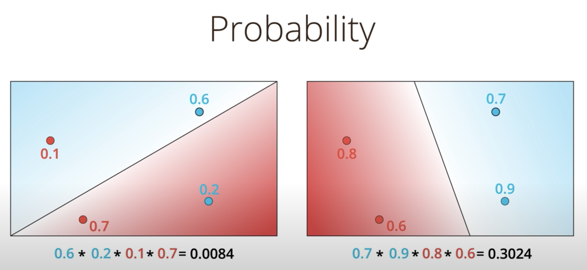

To get these probabilities, use `y = σ(Wx + b)`. Note that if the probability is misclassified, the probability is 1 - P(correct).

* Our new goal: use maximum likelihood to maximize `P(All)`

# 19 - Maximizing Probabilities

* However, products of lots of probabilities are bad, because 1) they will result in very small probability, and 2) changing one number could have big impact on overall probability

* We need a function that turns products into sums. Hint: recall that `log(ab) = log(a) + log(b)`

# 20 - Cross-Entropy 1

* So instead of 0.6 * 0.2 * 0.1 * 0.7 = 0.0084, we use:
    ```
    -ln(0.6) + -ln(0.2) + -ln(0.1) + -ln(0.7)
    = 0.51 + 1.61 + 2.3 + 0.36 = 4.8 (high, so not great)
    ```

* **cross-entropy**: -∑∑ yᵢⱼ ln(pᵢⱼ). how likely are the events, based on specified probabilities? low values are better than high values.

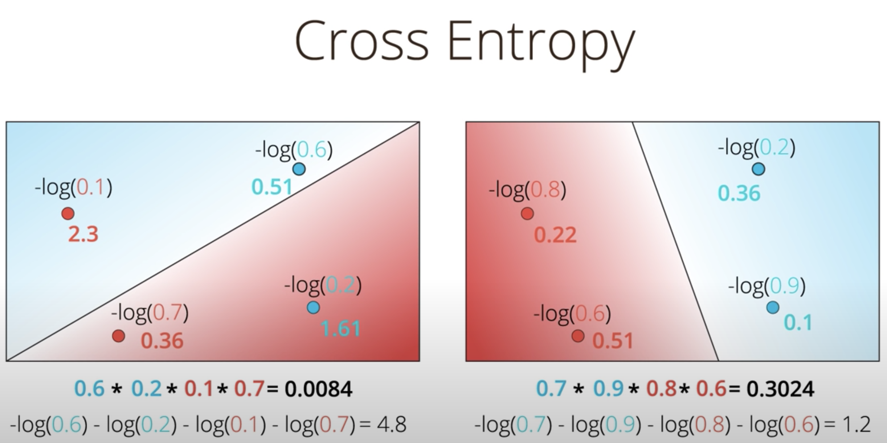

* New goal: instead of maximizing probability, minimize cross-entropy

# 21 - Cross-Entropy 2

* For two classes, the formula is:
    ```
    Cross-Entropy = -∑[yᵢln(pᵢ) + (1-yᵢ)ln(1-pᵢ)].
    ```
    Where `yᵢ` is `{0,1}` classification. (e.g., receive a gift or not.)

* In Python:
    ```python
    import numpy as np
    import math

    # For two classes
    def cross_entropy(Y, P):
        assert len(Y) == len(P)
        entropy = 0
        for i in range(0, len(P)):
            entropy -= Y[i] * math.log(P[i]) + (1 - Y[i]) * math.log(1 - P[i])
        return entropy
    ```

# 22 - Multi-Class Cross-Entropy

* For multiple classes, the formula is:
    ```
    Cross-Entropy = -∑∑ yᵢⱼ ln(pᵢⱼ)
    ```
  Where `yᵢⱼ` is `{0,1}` classification. (e.g., is it a walrus?)

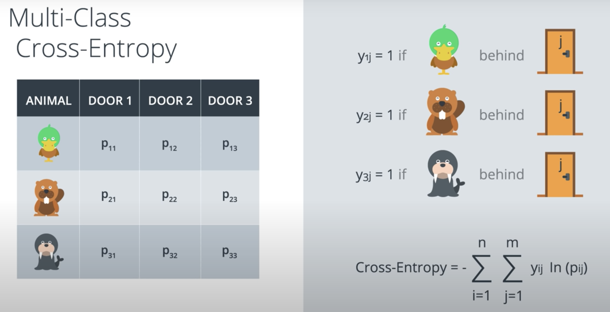

# 23 - Logistic Regression

* The logistic regression is the building block for deep learning

* Note:
  ```
  ŷ = P(yᵢ) = σ(Wxᵢ + b)
  ```

* **binary logistic regression error function**:
  ```
  error = -1/m ∑ (1-yᵢ) ln(1-ŷ) + yᵢ ln(ŷ)
        = -1/m ∑ (1-yᵢ) ln(1-σ(Wxᵢ + b)) + yᵢ ln(σ(Wxᵢ + b))
  ```

* **multi-class logistic regression error function**:
  ```
  error = -1/m ∑∑ yᵢⱼ ln(ŷ)
        = -1/m ∑∑ yᵢⱼ ln(σ(Wxᵢ + b))
  ```

* Our goal is to minimize the error.

# 24 - Gradient Descent

* Gradient descent can be thought of a graph, where the error is one axis, and other axes are the weights
    - We'll take steps in directions that reduce our error, as determined by partial derivates, `∂E/∂w₁`, `∂E/∂w₂`, ...etc, `∂E/∂b`
    - The size of these steps will be determined by the learning rate, `α`

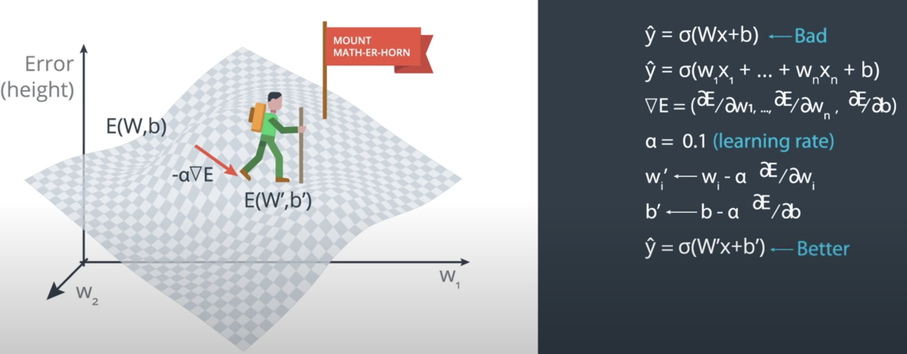

* Interestingly, the **gradient of the error function** is:
  ```
  ∇E = -(y - ŷ)x₁, ..., -(y-ŷ)xᵢ, -(y-ŷ)
     = -(y - ŷ)(x₁, ..., xᵢ, 1)
  ```

* **gradient descent step**:
  ```
  wᵢ′ <- wᵢ - α[-(y-ŷ)xᵢ]
      <- wᵢ + α(y-ŷ)xᵢ

  b′ <- b + α(y-ŷ)
  ```

# 25 - Logistic Regression Algorithm

* **gradient descent algorithm**:
  1. assign random weights w₁, ..., wᵢ, b
  2. for every point (x₁, ..., xᵢ):
       for i=1...n
           wᵢ′ <- wᵢ + α(y-ŷ)xᵢ
           b′ <- b + α(y-ŷ)
  3. repeat step 2 until error small, or fixed number of times

* The gradient descent algorithm is basically the perceptron algorithm!
  - The only difference is that gradient descent supports continuous values from 0 to 1, whereas perceptron algorithm supports discret values 0 or 1

# 26 - Pre-Lab: Gradient Descent

* Going to implement gradient descent. Note:
    - `sigmoid`: The sigmoid activation function.
    - `output_formula`: The formula for the prediction.
    - `error_formula`: The formula for the error at a point.
    - `update_weights`: The function that updates the parameters with one gradient descent step.

# 27 - Notebook: Gradient Descent

* **epoch**: iteration of gradient descent

```python
# Activation (sigmoid) function
def sigmoid(x):
    return 1 / (1 + np.exp(-x))

assert sigmoid(0) == .5
assert sigmoid(-100) > 0 and sigmoid(-100) < .5
assert sigmoid(1) > .5 and sigmoid(1) < 1

# Output (prediction) formula
def output_formula(features, weights, bias):
    return sigmoid(np.dot(features, weights) + bias)

# Error (log-loss) formula
def error_formula(y, output):
    return - y*np.log(output) - (1 - y) * np.log(1-output)

# Gradient descent step
def update_weights(x, y, weights, bias, learnrate):
    assert len(x) == len(weights)
    output = output_formula(x, weights, bias)
    weights = weights + learnrate * (y - output) * x
    bias = bias + learnrate * (y - output)
    return (weights, bias)
```

The data points:

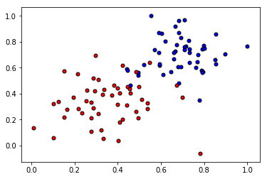

100 epochs, with each classifier line graphed:


Error function across 100 epochs:

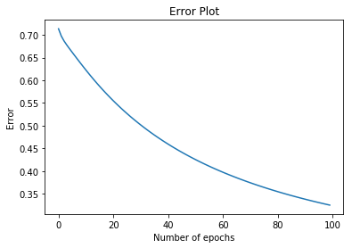

# 28 - Perceptron vs Gradient Descent

* Note that perceptrons points only update line if they are misclassified; however, with gradient descent, points always update line. Why?
    - They are telling the line to go farther away!

# 29 - Continuous Perceptrons

# 30 - Non-linear Data

# 31 - Non-linear Models

Intuition: the non-linear model produces a classifier made up of points equally likely to be blue or red:

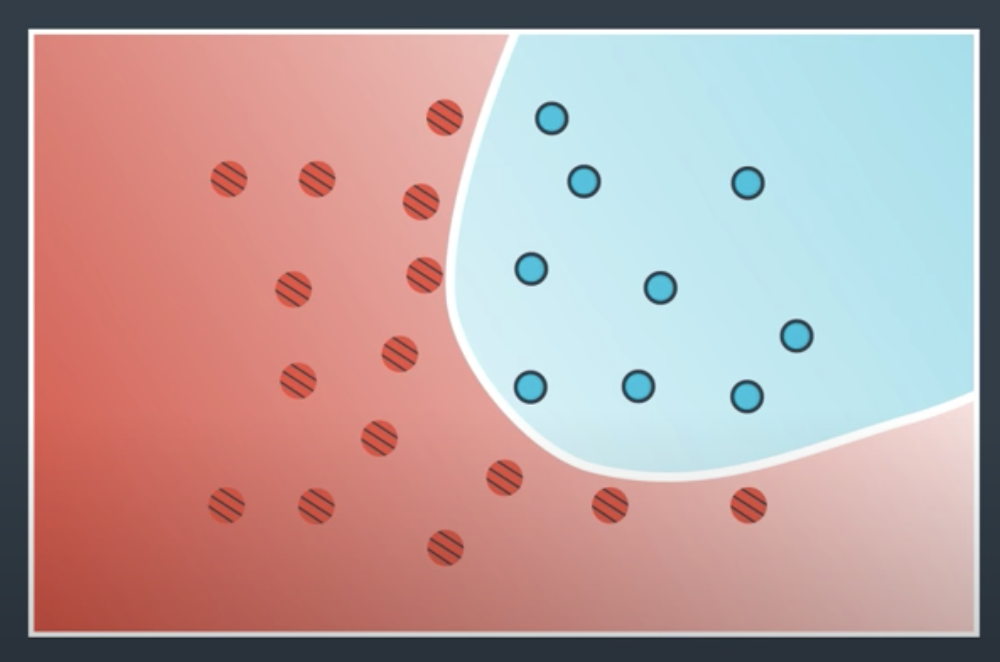

# 32 - Neural Network Architecture

* **multi-layer perceptrons**: another name for "neural networks"

* Can combine linear perceptrons to get more complex (non-linear) perceptrons
    - Basically, get probability for each point for all perceptrons, add them together, and take sigmoid to get the new probability:

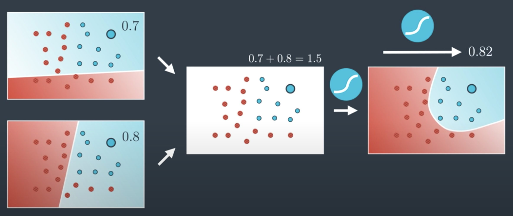

Note you can even add weights to these perceptrons, as well as add a bias:


:star: Complex neural networks are created out of linear combinations of existing neural networks.

I.e., non-linear models can be created using linear combinations of linear models.

Here's the above example as a (non-linear) neural network:


This can be represented more simply as:

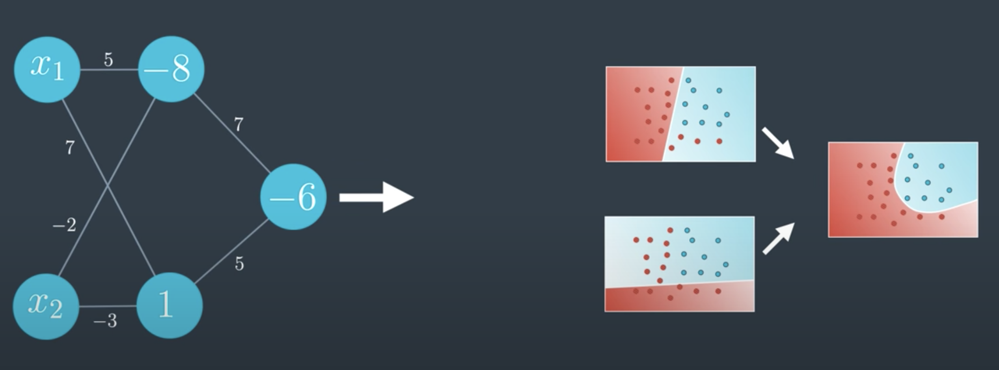

Alternatively, can represent the bias as a separate node:

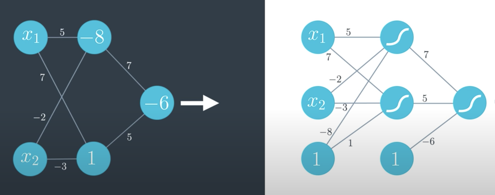

E.g., let's define the combination of two new perceptrons as w₁*0.4 + w₂*0.6 + b. Given w₁ = 3, w₂ = 5, b = -2.2, what's the probability of this point?

```
ŷ = 3 * .4 + 5 * 0.6 - 2.2
  = 2
p(y) = 1/(1+e^-ŷ)
     = 1/(1+e^-2)
     = 0.880797078
```

Neural networks have three layers: **input layer**, **hidden layer**, **output layer**.

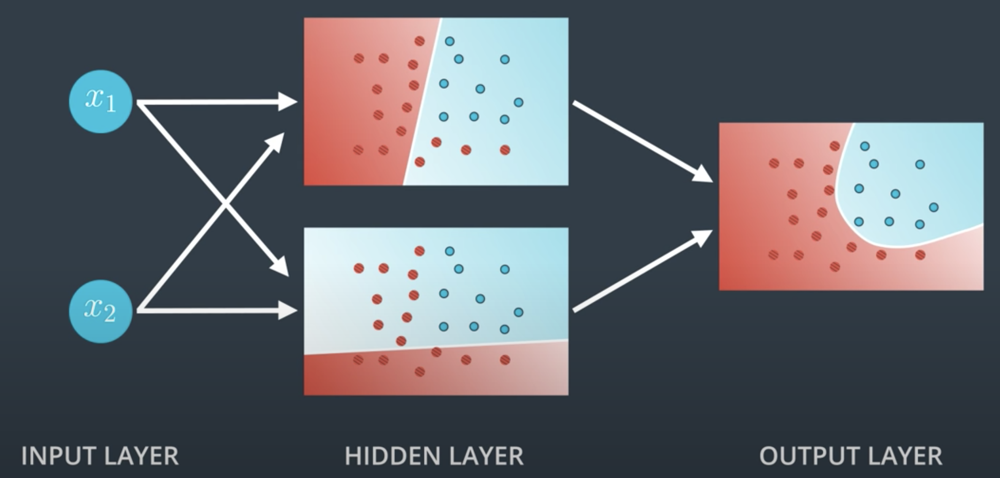

Note if you add more inputs, the dimensionality increases. In general, if you have n input nodes, your output will be n dimensions:

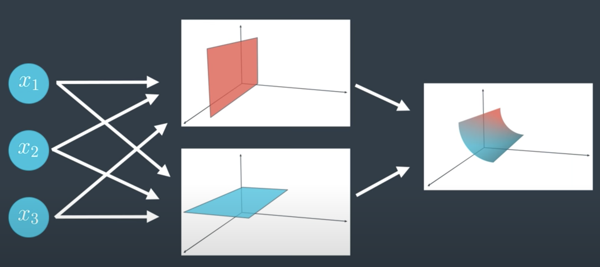

If you have multiple output nodes, you have a **multi-class neural network**:

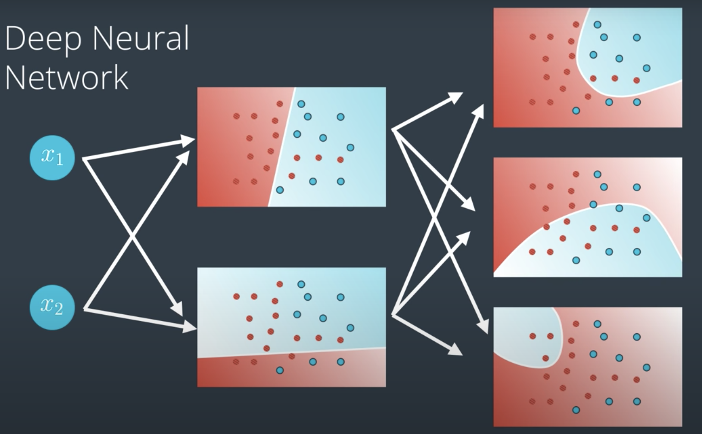

**deep neural network**: neural network with more than one hidden layer

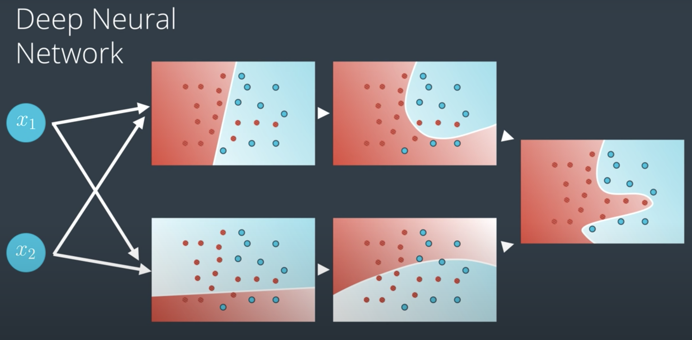

More layers give the model more degrees of freedom to capture complex patterns in the data:

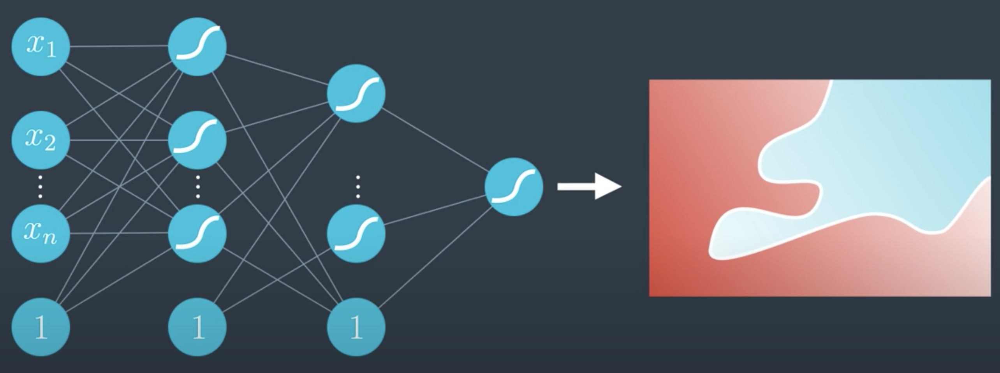

# 33 - Feedforward

* **feedforward**: process neural networks use to turn the inputs into output(s)

* **feedforward formula**: ŷ = σ ⚬ W⁽²⁾ ⚬ σ ⚬ W⁽¹⁾x

Single hidden layer:

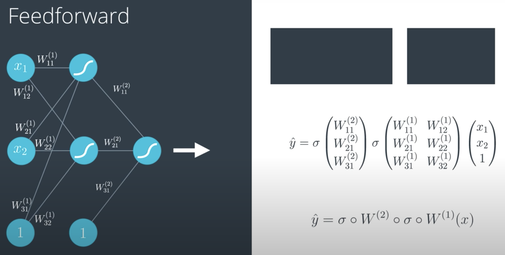

Multilayer:

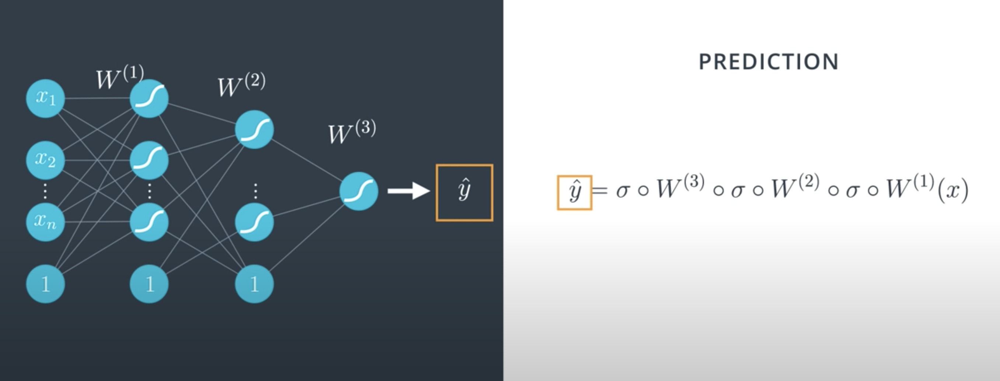

Error:

```
E(W) = -1/m ∑ yᵢ ln(ŷ) + (1-yᵢ) ln(1-ŷ)
```

# 34 - Backpropogation

# 35 - Pre-lab: Analyzing Student Data

# 36 - Notebook: Analyzing Student Data

# 37 - Outro
