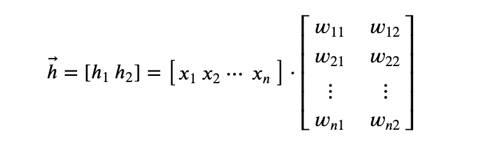

# Deep Learning with TensorFlow

## 1. Welcome!

* **transfer learning**: using pre-trained networks to improve the performance of your models

## 2. Pre-Notebooks

## 3. Notebooks

## 4. Introduction to TensorFlow

* Going to use TensorFlow version `tensorflow-gpu=2.0.0b1`

* Recap of neural networks:
    

* **tensors**: an n-dimensional array. This is a generalization of vectors and matrices.

## 5. Single Layer Neural Network

* In TensorFlow, tensors are `tf.Tensor` objects

* Creating a single-layer neural network:
    ```python
    tf.random.set_seed(7)

    # Create 5 random input features
    #   1 row, 5 columns
    features = tf.random.normal((1, 5))
    weights = tf.random.normal((1, 5))
    bias = tf.random.normal((1, 1))

    def sigmoid_activation(x):
        return 1/(1 + tf.exp(-x))

    # Element-wise solution. NOT efficient.
    #   We really want tf.matmul()
    h = tf.reduce_sum(tf.multiply(features, weights)) + bias
    y = sigmoid_activation(h)

    # Matrix solution. GPU accelerated.
    #   Note there's also a transpose_a parameter.
    h = tf.matmul(features, weights, transpose_b = True) + bias
    y = sigmoid_activation(h)
    ```

## 6. Multi-Layer Neural Network

* Matrix representation of multi-layer neural network:
    
    
    

* Calcuting output of multi-layer neural network with TensorFlow:
    ```python
    # Set the random seed so things are reproducible
    tf.random.set_seed(7)

    features = tf.random.normal((1,3))

    # hyperparameters (size of our network)
    n_input = features.shape[1]
    n_hidden = 2
    n_output = 1

    # weights
    W1 = tf.random.normal((n_input,n_hidden))
    W2 = tf.random.normal((n_hidden, n_output))

    # biases
    B1 = tf.random.normal((1,n_hidden))
    B2 = tf.random.normal((1, n_output))

    # (1,3) . (3,2) + (1,2)
    h1 = tf.matmul(features, W1) + B1
    # (1,2)
    y1 = sigmoid_activation(h1)
    # (1,2) . (2,1) + (1,1)
    h2 = tf.matmul(y1, W2) + B2
    # (1, 1)
    output = sigmoid_activation(h2)

    print(output)
    ```

## 7. NumPy to TF and back

```python
tf.random.set_seed(7)

# numpy array
a = np.random.rand(4,3)

# convert to TensorFlow
b = tf.convert_to_tensor(a)

# convert back to TensorFlow
c = b.numpy()

# doesn't impact a or c
b = b * 40

# doesn't impact b or c
a = a + 1
```

## 8. MNIST

* **Keras**: an interface for TensorFlow (and other libraries) for working with deep neural networks

* **`tensorflow_datasets`** contains a [bunch of different datasets](https://www.tensorflow.org/datasets/catalog/overview), including the MNIST dataset

* `tqdm` is a progress bar library used by `tensorflow_databases`

* **MNIST dataset**: dataset containing 28x28 pixel images of handwritten digits

* Loading MNIST dataset and viewing useful metadata:
    ```python
    training_set, dataset_info = tfds.load('mnist', split = 'train', as_supervised = True, with_info = True)

    # 10
    num_classes = dataset_info.features['label'].num_classes
    print('There are {:,} classes in our dataset'.format(num_classes))

    # 60,000
    num_training_examples = dataset_info.splits['train'].num_examples
    print('\nThere are {:,} images in the training set'.format(num_training_examples))

    for image, label in training_set.take(1):
        print('The images in the training set have:')
        print('\u2022 dtype:', image.dtype) # <dtype: 'uint8'>
        print('\u2022 shape:', image.shape) # (28, 28, 1)

        print('\nThe labels of the images have:')
        print('\u2022 dtype:', label.dtype) # <dtype: 'int64'>
    ```

* Rendering MNIST images:
    ```python
    for image, label in training_set.take(1):
        # squeeze converts from (28, 28, 1) -> (28, 28)
        #   as it remove single dimensional entries from array
        image = image.numpy().squeeze()
        label = label.numpy()

    plt.imshow(image, cmap = plt.cm.binary)
    plt.colorbar()
    plt.show()

    print('The label of this image is:', label)
    ```

## 9. Creating Pipelines

## 10. Implementing Softmax

## 11. Neural Networks with TensorFlow

## 12. Looking at Weights and Biases

## 13. Making Predictions

## 14. Subclassing

## 15. Adding Layers with .add

## 16. Clearing the Graph

## 17. Getting the Model Ready for Training

## 18. Training the Model

## 19. Automatic Differentiation

## 20. Fashion-MNIST

## 21. Inference & Validation

## 22. Early Stopping

## 23. Dropout

## 24. Dropout Solution

## 25. Saving & Loading

## 26. Loading Images with TensorFlow

## 27. Data Augmentation

## 28. Data Augmentation Solution

## 29. Pre-Notebooks with GPU

## 30. GPU-enabled Workspace

## 31. A Note on Transfer Learning

## 32. Transfer Learning

## 33. Transfer Learning II

## 34. Transfer Learning Solution

## 35. Recap
