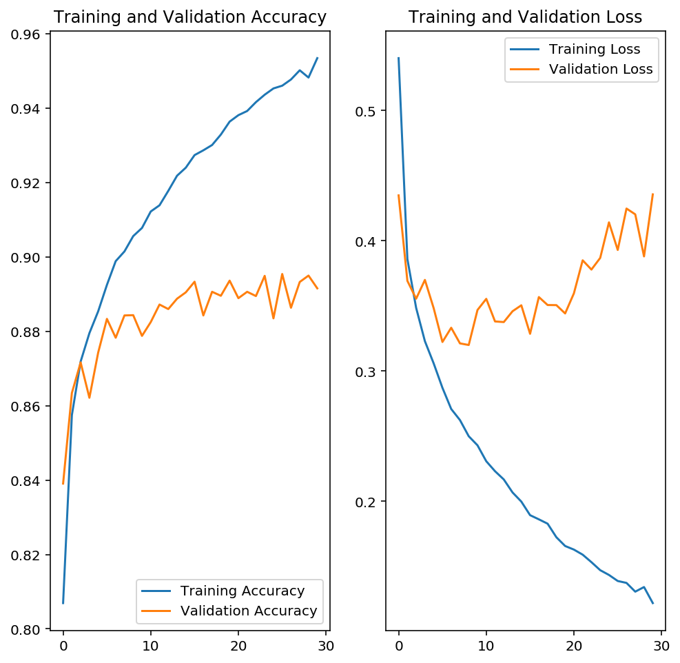
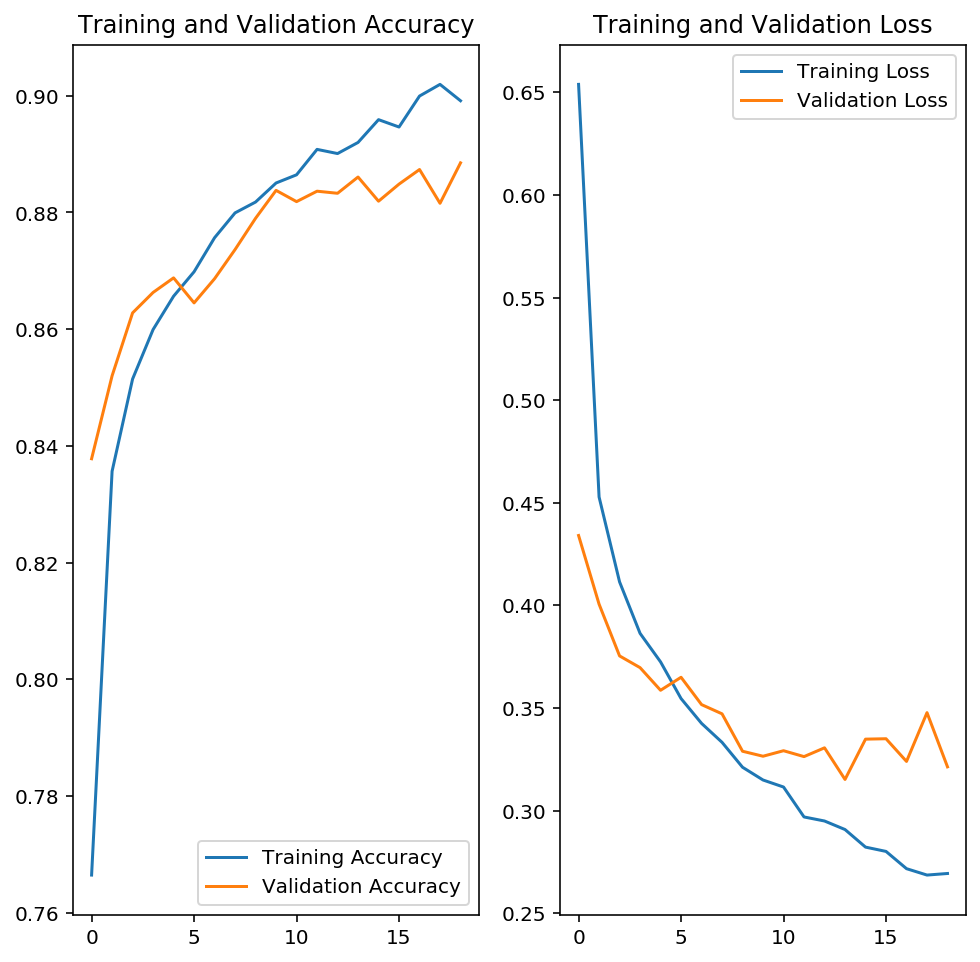
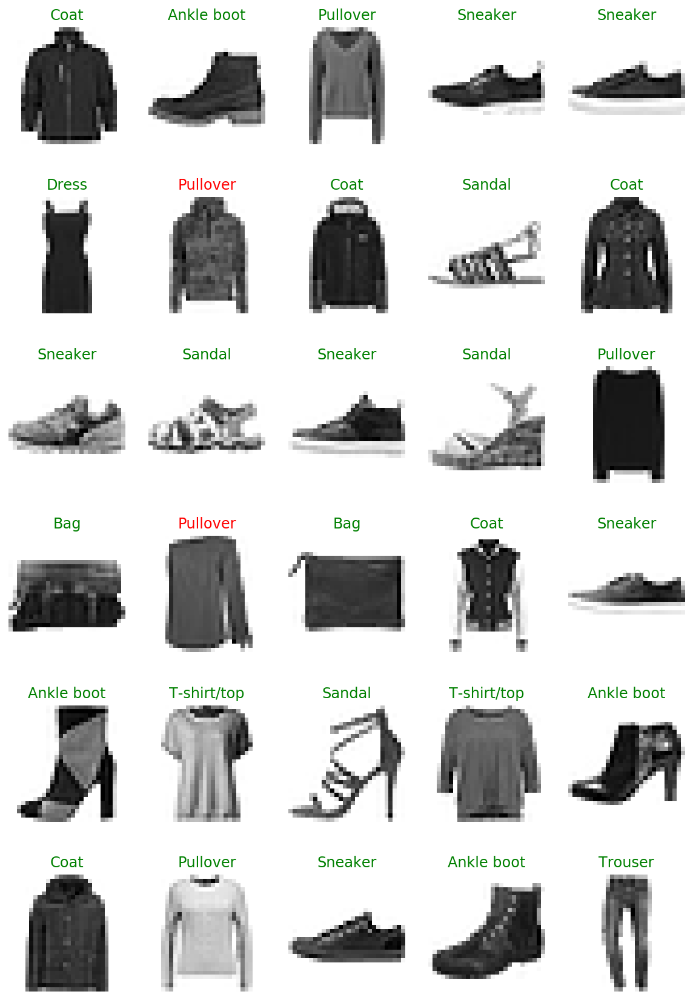
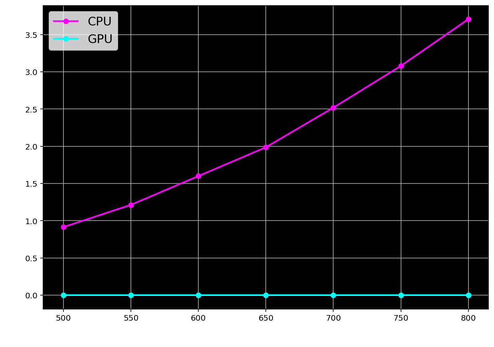

# Deep Learning with TensorFlow

## 1. Welcome!

* **transfer learning**: using pre-trained networks to improve the performance of your models

## 2. Pre-Notebooks

## 3. Notebooks

## 4. Introduction to TensorFlow

* Going to use TensorFlow version `tensorflow-gpu=2.0.0b1`

* Recap of neural networks:
    

* **tensors**: an n-dimensional array. This is a generalization of vectors and matrices.

## 5. Single Layer Neural Network

* In TensorFlow, tensors are `tf.Tensor` objects

* Creating a single-layer neural network:
    ```python
    tf.random.set_seed(7)

    # Create 5 random input features
    #   1 row, 5 columns
    features = tf.random.normal((1, 5))
    weights = tf.random.normal((1, 5))
    bias = tf.random.normal((1, 1))

    def sigmoid_activation(x):
        return 1/(1 + tf.exp(-x))

    # Element-wise solution. NOT efficient.
    #   We really want tf.matmul()
    h = tf.reduce_sum(tf.multiply(features, weights)) + bias
    y = sigmoid_activation(h)

    # Matrix solution. GPU accelerated.
    #   Note there's also a transpose_a parameter.
    h = tf.matmul(features, weights, transpose_b = True) + bias
    y = sigmoid_activation(h)
    ```

## 6. Multi-Layer Neural Network

* Matrix representation of multi-layer neural network:
    
    
    

* Calcuting output of multi-layer neural network with TensorFlow:
    ```python
    # Set the random seed so things are reproducible
    tf.random.set_seed(7)

    features = tf.random.normal((1,3))

    # hyperparameters (size of our network)
    n_input = features.shape[1]
    n_hidden = 2
    n_output = 1

    # weights
    W1 = tf.random.normal((n_input,n_hidden))
    W2 = tf.random.normal((n_hidden, n_output))

    # biases
    B1 = tf.random.normal((1,n_hidden))
    B2 = tf.random.normal((1, n_output))

    # (1,3) . (3,2) + (1,2)
    h1 = tf.matmul(features, W1) + B1
    # (1,2)
    y1 = sigmoid_activation(h1)
    # (1,2) . (2,1) + (1,1)
    h2 = tf.matmul(y1, W2) + B2
    # (1, 1)
    output = sigmoid_activation(h2)

    print(output)
    ```

## 7. NumPy to TF and back

```python
tf.random.set_seed(7)

# numpy array
a = np.random.rand(4,3)

# convert to TensorFlow
b = tf.convert_to_tensor(a)

# convert back to TensorFlow
c = b.numpy()

# doesn't impact a or c
b = b * 40

# doesn't impact b or c
a = a + 1
```

## 8. MNIST

* **Keras**: an interface for TensorFlow (and other libraries) for working with deep neural networks

* **`tensorflow_datasets`** contains a [bunch of different datasets](https://www.tensorflow.org/datasets/catalog/overview), including the MNIST dataset

* `tqdm` is a progress bar library used by `tensorflow_databases`

* **MNIST dataset**: dataset containing 28x28 pixel images of handwritten digits

* Loading MNIST dataset and viewing useful metadata:
    ```python
    training_set, dataset_info = tfds.load('mnist', split = 'train', as_supervised = True, with_info = True)

    # 10
    num_classes = dataset_info.features['label'].num_classes
    print('There are {:,} classes in our dataset'.format(num_classes))

    # 60,000
    num_training_examples = dataset_info.splits['train'].num_examples
    print('\nThere are {:,} images in the training set'.format(num_training_examples))

    for image, label in training_set.take(1):
        print('The images in the training set have:')
        print('\u2022 dtype:', image.dtype) # <dtype: 'uint8'>
        print('\u2022 shape:', image.shape) # (28, 28, 1)

        print('\nThe labels of the images have:')
        print('\u2022 dtype:', label.dtype) # <dtype: 'int64'>
    ```

* Rendering MNIST images:
    ```python
    import matplotlib.pyplot as plt

    for image, label in training_set.take(1):
        # squeeze converts from (28, 28, 1) -> (28, 28)
        #   as it remove single dimensional entries from array
        image = image.numpy().squeeze()
        label = label.numpy()

    plt.imshow(image, cmap = plt.cm.binary)
    plt.colorbar()
    plt.show()

    print('The label of this image is:', label)
    ```

## 9. Creating Pipelines

* Example pipeline:
    ```python
    def normalize(image, label):
        image = tf.cast(image, tf.float32)
        image /= 255
        return image, label

    batch_size = 64

    training_batches = training_set.cache()
        .shuffle(num_training_examples//4)
        .batch(batch_size)
        .map(normalize)
        .prefetch(1)

    for image_batch, label_batch in training_batches.take(1):
        # do something with image & label
    ```

* Useful resources:
    - [Better performance with the tf.data API](https://www.tensorflow.org/guide/data_performance)
    - [Dataset methods](https://www.tensorflow.org/api_docs/python/tf/data/Dataset#methods_2)

## 10. Implementing Softmax

* **flattening**: converting a multidimensional array (e.g., 28x28 pixel image) to a one-dimensional array (e.g., 784 pixel array)

* **dense network**: a network that is fully connected

* Getting output (without final activation function):
    ```python
    def activation(x):
        return 1/(1+tf.exp(x))

    # (64, 784)
    inputs = tf.reshape(images, [images.shape[0], -1])

    w1 = tf.random.normal((784,256))
    b1 = tf.random.normal((1,256))

    w2 = tf.random.normal((256,10))
    b2 = tf.random.normal((1,10))

    # (64, 784) . (784, 256) + (1, 256) = (64, 256)
    h = activation(tf.matmul(inputs, w1) + b1)

    # (64, 256) . (256, 10) + (1, 10) = (64, 10)
    output = tf.matmul(h, w2) + b2
    ```

* Now, applying softmax activation function:
    ```python
    # (64, 10) -> (64, 10)
    def softmax(x):
        # (64, 10) / (64, 1) = (64, 10)
        return tf.exp(x) / tf.reduce_sum(tf.exp(x), axis = 1, keepdims = True)

    # (64, 10)
    probabilities = softmax(output)
    ```

## 11. Neural Networks with TensorFlow

* The same as above, but with Keras:
    ```python
    model = tf.keras.Sequential([
        # input layer
        tf.keras.layers.Flatten(input_shape = (28,28,1)),
        # hidden layer
        tf.keras.layers.Dense(256, activation = 'sigmoid'),
        # output layer
        tf.keras.layers.Dense(10, activation = 'softmax')
    ])
    ```

* Note that each layer (besides input layer) have shape inference

* **Exercise**. Build the following network:
    
    ```python
    my_model_1 = tf.keras.Sequential([
        tf.keras.layers.Flatten(input_shape = (28,28,1)),
        tf.keras.layers.Dense(128, activation = 'relu'),
        tf.keras.layers.Dense(64, activation = 'relu'),
        tf.keras.layers.Dense(10, activation = 'softmax')
    ])

    my_model_1.summary()
    ```

* Some activation functions:
    

## 12. Looking at Weights and Biases

* Note Keras automatically attaches weights and biases to layers

* To retrieve weights and biases for a layer:
    ```python
    # first input layer:
    weights = model.get_layer(index=1).get_weights()[0]
    biases = model.get_layer(index=1).get_weights()[1]
    ```

## 13. Making Predictions

```python
for image_batch, label_batch in training_batches.take(1):
    ps = model.predict(image_batch)
    first_image = image_batch.numpy().squeeze()[0]
```

## 14. Subclassing

* For fully customizable models, need to subclass the `ts.keras.Model` class. E.g.,
    ```python
    class Network(tf.keras.Model):
        def __init__(self, num_classes = 2):
            super().__init__()
            self.num_classes = num_classes

            # Define layers
            self.input_layer = tf.keras.layers.Flatten()
            self.hidden_layer = tf.keras.layers.Dense(256, activation = 'relu')
            self.output_layer = tf.keras.layers.Dense(self.num_classes, activation = 'softmax')

        # Define forward Pass   
        def call(self, input_tensor):
            x = self.input_layer(input_tensor)
            x = self.hidden_layer(x)
            x = self.output_layer(x)

            return x

    subclassed_model = Network(10)

    # initialize model params (weights and biases)
    subclassed_model.build((None, 28, 28, 1))

    subclassed_model.summary()
    ```

* **Exercise**. Create the following network using subclassing:
    
    ```python
    class Network(tf.keras.Model):
        def __init__(self, num_classes = 2):
            super().__init__()
            self.num_classes = num_classes

            # layers
            self.input_layer = tf.keras.layers.Flatten()
            self.hidden_layer_1 = tf.keras.layers.Dense(128, activation = 'relu')
            self.hidden_layer_2 = tf.keras.layers.Dense(64, activation = 'relu')
            self.output_layer = tf.keras.layers.Dense(self.num_classes, activation = 'softmax')

        def call(self, input_tensor):
            x = self.input_layer(input_tensor)
            x = self.hidden_layer_1(x)
            x = self.hidden_layer_2(x)
            x = self.output_layer(x)

    my_model_2 = Network(10)
    my_model_2.build((None, 28, 28, 1))
    my_model_2.summary()

    w1 = my_model_2.hidden_layer_1.get_weights()[0]
    b1 = my_model_2.hidden_layer_1.get_weights()[1]

    print('\nThis layer has a total of {:,} weights and {:,} biases'.format(w1.size, b1.size))
    ```

## 15. Adding Layers with .add

```python
from tensorflow.keras.layers import Flatten, Dense

layer_neurons = [512, 256, 128, 56, 28, 14]

model = tf.keras.Sequential()
model.add(Flatten(input_shape = (28,28,1)))

for neurons in layer_neurons:
    model.add(Dense(neurons, activation='relu'))

model.add(Dense(10, activation='softmax'))

model.summary()          
```

## 16. Clearing the Graph

```python
tf.keras.backend.clear_session()
```

## 17. Getting the Model Ready for Training

* To recap, backpropagation is about apply partial derivates backwards through the graph:
    

* To prepare the model for training, we must compile it.
    ```python
    model.compile(optimizer='adam',
                  loss='sparse_categorical_crossentropy',
                  metrics=['accuracy'])
    ```

* More information:
    - [List of optimizers](https://www.tensorflow.org/versions/r2.0/api_docs/python/tf/keras/optimizers#classes)
    - [List of loss functions](https://www.tensorflow.org/versions/r2.0/api_docs/python/tf/keras/losses#classes)
    - [List of metrics](https://www.tensorflow.org/versions/r2.0/api_docs/python/tf/keras/metrics#classes)

* To calculate loss and accuracy before training:
    ```python
    for image_batch, label_batch in training_batches.take(1):
        loss, accuracy = model.evaluate(image_batch, label_batch)
    ```

## 18. Training the Model

* Train model with `.fit` method:
    ```python
    EPOCHS = 5

    history = model.fit(training_batches, epochs = EPOCHS)

    for image_batch, label_batch in training_batches.take(1):
        ps = model.predict(image_batch)
        # ... do something with prediction

    for image_batch, label_batch in training_batches.take(1):
        loss, accuracy = model.evaluate(image_batch, label_batch)
        # loss around 0.086 and accuracy around 96.875%
    ```

* **Exercise**. Create a network with 784 input units, a hidden layer with 128 units, then a hidden layer with 64 units, then a hidden layer with 32 units and finally an output layer with 10 units. Use a ReLu activation function for all the hidden layers and a softmax activation function for the output layer. Then compile the model using an adam optimizer, a sparse_categorical_crossentropy loss function, and the accuracy metric.

    ```python
    from tensorflow.keras.layers import Flatten, Dense

    EPOCHS = 5

    model = tf.keras.Sequential()
    model.add(Flatten(input_shape = (28,28,1)))

    for neurons in [128, 64, 32]:
        model.add(Dense(neurons, activation='relu'))

    model.add(Dense(10, activation='softmax'))

    model.compile(optimizer='adam',
              loss='sparse_categorical_crossentropy',
              metrics=['accuracy'])

    history = model.fit(training_batches, epochs = EPOCHS)

    for image_batch, label_batch in training_batches.take(1):
        loss, accuracy = model.evaluate(image_batch, label_batch)

    print('\nLoss after training: {:,.3f}'.format(loss))
    print('Accuracy after training: {:.3%}'.format(accuracy))
    ```

## 19. Automatic Differentiation

* TensorFlow automatically watches parameters to perform automatic differentiation

* Here's how you can programmatically perform differentiation using `tf.GradientTape`:
    ```python
    tf.random.set_seed(7)

    # create random tensor
    x = tf.random.normal((2,2))

    # Calculate gradient
    with tf.GradientTape() as g:
        g.watch(x)
        y = x ** 2

    dy_dx = g.gradient(y, x)

    print('Value found by tf.GradientTape:\n', dy_dx)

    print('\nExpected value:\n', 2 * x)
    ```

## 20. Fashion-MNIST

## 21. Inference & Validation

* We're going to split the data into 60% training, 20% validation, 20% testing:
    ```python
    splits = tfds.Split.ALL.subsplit([60, 20, 20])
    dataset, dataset_info = tfds.load('fashion_mnist', split=splits, as_supervised=True, with_info=True)
    training_set, validation_set, test_set = dataset

    ...

    EPOCHS = 30

    history = model.fit(training_batches,
                        epochs = EPOCHS,
                        validation_data=validation_batches)
    ```

* Since we're using validation data, we can see an example of overfitting, as the validation error (loss) is much higher than the testing data error:
    ```
    Epoch 30/30
    657/657 [==============================] - 3s 5ms/step - loss: 0.1224 - accuracy: 0.9535 - val_loss: 0.4357 - val_accuracy: 0.8916
    ```

* We can use the `history` object returned by the fitted model to graph the accuracy and loss across epocs:
    ```python
    training_accuracy = history.history['accuracy']
    validation_accuracy = history.history['val_accuracy']

    training_loss = history.history['loss']
    validation_loss = history.history['val_loss']

    epochs_range=range(EPOCHS)

    plt.figure(figsize=(8, 8))
    plt.subplot(1, 2, 1)
    plt.plot(epochs_range, training_accuracy, label='Training Accuracy')
    plt.plot(epochs_range, validation_accuracy, label='Validation Accuracy')
    plt.legend(loc='lower right')
    plt.title('Training and Validation Accuracy')

    plt.subplot(1, 2, 2)
    plt.plot(epochs_range, training_loss, label='Training Loss')
    plt.plot(epochs_range, validation_loss, label='Validation Loss')
    plt.legend(loc='upper right')
    plt.title('Training and Validation Loss')
    plt.show()
    ```
    

## 22. Early Stopping

* We can implement early stopping in `tf.keras` by passing a callback to the `model.fit` method using the `callbacks` keyword argument.
    ```python
    early_stopping = tf.keras.callbacks.EarlyStopping(monitor='val_loss', patience=5)

    history = model.fit(training_batches,
                        epochs = 100,
                        validation_data=validation_batches,
                        callbacks=[early_stopping])
    ```
    ```
    ...
    Epoch 11/100
    657/657 [==============================] - 3s 5ms/step - loss: 0.2305 - accuracy: 0.9123 - val_loss: 0.3277 - val_accuracy: 0.8895
    Epoch 12/100
    657/657 [==============================] - 3s 5ms/step - loss: 0.2236 - accuracy: 0.9163 - val_loss: 0.3492 - val_accuracy: 0.8833
    Epoch 13/100
    657/657 [==============================] - 3s 5ms/step - loss: 0.2168 - accuracy: 0.9184 - val_loss: 0.3404 - val_accuracy: 0.8887
    Epoch 14/100
    657/657 [==============================] - 3s 5ms/step - loss: 0.2080 - accuracy: 0.9214 - val_loss: 0.3407 - val_accuracy: 0.8869
    Epoch 15/100
    657/657 [==============================] - 3s 5ms/step - loss: 0.1990 - accuracy: 0.9239 - val_loss: 0.3362 - val_accuracy: 0.8922
    Epoch 16/100
    657/657 [==============================] - 3s 5ms/step - loss: 0.1868 - accuracy: 0.9279 - val_loss: 0.3454 - val_accuracy: 0.8914
    ```
    

* See documentation:
    - [`tf.keras.callbacks.EarlyStopping`](https://www.tensorflow.org/versions/r2.0/api_docs/python/tf/keras/callbacks/EarlyStopping#class_earlystopping)
    - [`tf.keras.callbacks`](https://www.tensorflow.org/api_docs/python/tf/keras/callbacks): other useful callbacks

## 23. Dropout

* Full solution, implementing early stopping and drop out:
    ```python
    from tensorflow.keras import Sequential
    from tensorflow.keras.callbacks import EarlyStopping
    from tensorflow.keras.layers import Dense, Dropout, Flatten

    def plot_complexity_graphs(history):
        training_accuracy = history.history['accuracy']
        validation_accuracy = history.history['val_accuracy']

        training_loss = history.history['loss']
        validation_loss = history.history['val_loss']

        epochs_range=range(len(training_accuracy))

        plt.figure(figsize=(8, 8))
        plt.subplot(1, 2, 1)
        plt.plot(epochs_range, training_accuracy, label='Training Accuracy')
        plt.plot(epochs_range, validation_accuracy, label='Validation Accuracy')
        plt.legend(loc='lower right')
        plt.title('Training and Validation Accuracy')

        plt.subplot(1, 2, 2)
        plt.plot(epochs_range, training_loss, label='Training Loss')
        plt.plot(epochs_range, validation_loss, label='Validation Loss')
        plt.legend(loc='upper right')
        plt.title('Training and Validation Loss')
        plt.show()

    DROPOUT_RATE = 0.2
    HIDDEN_LAYER_NEURONS = [256, 128, 64]
    EARLY_STOPPING_PATIENCE = 5
    EPOCHS = 100

    # input layer
    model = Sequential([
        Flatten(input_shape=(28,28,1))
    ])

    # hidden layers
    for neurons in HIDDEN_LAYER_NEURONS:
        model.add(Dense(neurons, activation='relu'))
        model.add(Dropout(DROPOUT_RATE))

    # output layer
    model.add(Dense(10, activation='softmax'))

    model.compile(optimizer='adam',
                  loss='sparse_categorical_crossentropy',
                  metrics=['accuracy'])

    early_stopping = EarlyStopping(monitor='val_loss', patience=EARLY_STOPPING_PATIENCE)

    history = model.fit(training_batches,
                        epochs = EPOCHS,
                        validation_data=validation_batches,
                        callbacks=[early_stopping])

    plot_complexity_graphs(history)
    ```
    

* Let's look at a sample of Fashion-MNIST data; green is valid prediction, red is invalid prediction:
    ```python
    for image_batch, label_batch in testing_batches.take(1):
        ps = model.predict(image_batch)
        images = image_batch.numpy().squeeze()
        labels = label_batch.numpy()

    plt.figure(figsize=(10,15))

    for n in range(30):
        plt.subplot(6,5,n+1)
        plt.imshow(images[n], cmap = plt.cm.binary)
        color = 'green' if np.argmax(ps[n]) == labels[n] else 'red'
        plt.title(class_names[np.argmax(ps[n])], color=color)
        plt.axis('off')
    ```
    

## 24. Dropout Solution

## 25. Saving & Loading

* Learn how to save our models in TensorFlow's SavedModel format and as Keras' HDF5 format

* Saving and loading model using HDF5 format:
    ```python
    model_path = './test_model.h5'
    my_model.save(model_path)
    reloaded_model = tf.keras.models.load_model(model_path)
    ```

* Saving and loading model using SavedModel format:
    ```python
    dir = './saved_models'
    tf.saved_model.save(my_model, dir)          # stores multiple assets in target directory

    # method #1:
    reloaded_model = tf.saved_model.load(dir)   # _not_ a Keras object; no .fit, .predict, .summary
    reloaded_model(image_batch, training=False) # how to make predictions with this returned model

    # method #2:
    reloaded_model = tf.keras.models.load_model(dir) # Keras object
    ```

* We can save checkpoints of our model using `tf.keras.callbacks.ModelCheckpoint`:
    ```python
    from tensorflow.keras.layers import Dense, Flatten
    from tensorflow.keras.callbacks import EarlyStopping, ModelCheckpoint

    model = tf.keras.Sequential([
        Flatten(input_shape=(28,28,1))
    ])

    for neurons in [256, 128, 64]:
        model.add(Dense(neurons, activation='relu'))

    model.add(Dense(10, activation = 'softmax'))

    model.compile(optimizer='adam',
                  loss='sparse_categorical_crossentropy',
                  metrics=['accuracy'])

    # stop when no improvement in loss for 10 consecutive epochs
    early_stopping = EarlyStopping(monitor='val_loss', patience=10)

    # save model w/ lowest validation loss
    save_best = ModelCheckpoint('./best_model.h5',
                                monitor='val_loss',
                                save_best_only=True)

    history = model.fit(training_batches,
                        epochs = 100,
                        validation_data=validation_batches,
                        callbacks=[early_stopping, save_best])
    ```

## 26. Loading Images with TensorFlow

* Downloading files using `tf.keras.utils.get_file(fname, origin)`:
    ```python
    URL = 'https://storage.googleapis.com/mledu-datasets/cats_and_dogs_filtered.zip'

    zip_dir = tf.keras.utils.get_file('cats_and_dogs_filterted.zip', origin=URL, extract=True)
    ```

* Typically, files are downloaded to cache location `~/.keras/datasets/`

## 27. Data Augmentation

* Going to use Keras' `ImageDataGenerator` for image preprocessing

* When training neural networks, commonly introduce randomness in the input data; e.g., randomly rotate, flip, scale, crop the images.

* To randomly horizontally flip a subset of the data:
    ```python
    image_gen = ImageDataGenerator(rescale=1./255, horizontal_flip=True)

    train_data_gen = image_gen.flow_from_directory(directory=train_dir,
                                                   batch_size=BATCH_SIZE,
                                                   shuffle=True,
                                                   target_size=(IMG_SHAPE,IMG_SHAPE),
                                                   class_mode='binary')
    ```

* To randomly rotate an image up to a specified angle:
    ```python
    image_gen = ImageDataGenerator(rescale=1./255, rotation_range=45)

    train_data_gen = image_gen.flow_from_directory(directory=train_dir,
                                                   batch_size=BATCH_SIZE,
                                                   shuffle=True,
                                                   target_size=(IMG_SHAPE, IMG_SHAPE),
                                                   class_mode='binary')
    ```

* To randomly zoom up to a specified percentage:
    ```python
    image_gen = ImageDataGenerator(rescale=1./255, zoom_range=0.5)

    train_data_gen = image_gen.flow_from_directory(directory=train_dir,
                                                   batch_size=BATCH_SIZE,
                                                   shuffle=True,
                                                   target_size=(IMG_SHAPE, IMG_SHAPE),
                                                   class_mode='binary')
    ```

* These transformations, as well as other [ImageDataGenerator transformations](https://keras.io/api/preprocessing/image/), can be combined in one operation

* Note we normally don't shuffle nor transform the validation set; only the training set. However, we still normalize pixel values:
    ```python
    image_gen_val = ImageDataGenerator(rescale=1./255)

    val_data_gen = image_gen_val.flow_from_directory(directory=validation_dir,
                                                     batch_size=BATCH_SIZE,
                                                     target_size=(IMG_SHAPE, IMG_SHAPE),
                                                     class_mode='binary')
    ```

* When using `ImageDataGenerator`, use `.fit_generator` instead of `.fit`:
    ```python
    EPOCHS = 10

    history = model.fit_generator(train_data_gen,
                                  epochs=EPOCHS,
                                  validation_data=val_data_gen)
    ```

* **Exercise**. Build network that can classify dogs and cats with >50% accuracy. (Given using fully-connected networks and this contains color, won't expect high accuracy.)
    ```python
    from tensorflow.keras.layers import Dense, Flatten
    from tensorflow.keras.callbacks import EarlyStopping, ModelCheckpoint

    BATCH_SIZE = 64
    EPOCHS = 100
    HIDDEN_LAYERS = [1024, 512, 256, 128, 56, 28, 14]
    IMG_SHAPE = 224
    CHANNELS = 1 # Use 3 if rgb, 1 if greyscale

    # preprocess images to introduce randomness to training data
    def training_data_transformer_generator():
        image_gen = ImageDataGenerator(rescale=1./255,
                               rotation_range=30,
                               width_shift_range=0.2,
                               height_shift_range=0.2,
                               #shear_range=0.1,
                               zoom_range=0.2,
                               horizontal_flip=True,
                               fill_mode='nearest') # default

        return image_gen.flow_from_directory(directory=train_dir,
                                             batch_size=BATCH_SIZE,
                                             shuffle=True,
                                             target_size=(IMG_SHAPE, IMG_SHAPE),
                                             class_mode='binary',
                                             color_mode='grayscale')

    def validation_data_transformer_generator():
        image_gen_val = ImageDataGenerator(rescale=1./255)

        return image_gen_val.flow_from_directory(directory=validation_dir,
                                                 batch_size=BATCH_SIZE,
                                                 target_size=(IMG_SHAPE, IMG_SHAPE),
                                                 class_mode='binary',
                                                 color_mode='grayscale')

    # build model
    model = tf.keras.Sequential([
        Flatten(input_shape=(IMG_SHAPE, IMG_SHAPE, CHANNELS))
    ])

    for neurons in HIDDEN_LAYERS:
        model.add(Dense(neurons, activation='relu'))

    model.add(Dense(2, activation = 'softmax'))

    model.compile(optimizer='adam',
                  loss='sparse_categorical_crossentropy',
                  metrics=['accuracy'])

    # stop when no improvement in loss for 10 consecutive epochs
    early_stopping = EarlyStopping(monitor='val_loss', patience=5)

    # save model w/ lowest validation loss
    save_best = ModelCheckpoint('./best_model.h5',
                                monitor='val_loss',
                                save_best_only=True)

    # train model
    history = model.fit_generator(training_data_transformer_generator(),
                                  epochs=EPOCHS,
                                  validation_data=validation_data_transformer_generator(),
                                  callbacks=[early_stopping, save_best])
    ```

## 28. Data Augmentation Solution

## 29. Pre-Notebooks with GPU

## 30. GPU-enabled Workspace

## 31. A Note on Transfer Learning

* **transfer learning**: storing knowledge gained while solving one problem and applying it to a different but related problem

* Good idea to try existing trained neural network for similar problem, and then tuning it for your need
    - Saves time building and training
    - Helps if not have a lot of training data

* Using transfer learning:
    

* Overfitting is a concern when using transfer learning with a small data set

* **convolutional neural network** (**CNNs**): combines convolutional, pooling, and fully-connected layers in a network architecture that is particularly effective for image classification

* **convolution layer**: layers of CNN that apply filters across images

* **pooling layers**: layers of CNN that apply thresholds to the output of a convolution layer

* **fully-connected layers**: layers of CNN that take output from final pooling layers and perform classifications (by outputting multi-class probabilities, and caller picks the largest)

* Going to start with CNN:
    

* If the new data set is small and similar to the original training data:
    1. slice off the end of the neural network
    1. add a new fully connected layer that matches the number of classes in the new data set
    1. randomize the weights of the new fully connected layer; freeze all the weights from the pre-trained network
    1. train the network to update the weights of the new fully connected layer
    * Holding weights from original network constant helps prevent over training

* If the new data set is small and different from the original training data:
    1. slice off most of the pre-trained layers near the beginning of the network
    1. add to the remaining pre-trained layers a new fully connected layer that matches the number of classes in the new data set
    1. randomize the weights of the new fully connected layer; freeze all the weights from the pre-trained network
    1. train the network to update the weights of the new fully connected layer
    

* If the new data set is large and similar to the original training data:
    1. remove the last fully connected layer and replace with a layer matching the number of classes in the new data set
    1. randomly initialize the weights in the new fully connected layer
    1. initialize the rest of the weights using the pre-trained weights
    1. re-train the entire neural network
    * Overfitting is not as much of a concern when training on a large data set, so you can re-train all of the weights

* If the new data set is large and different from the original training data:
    1. remove the last fully connected layer and replace with a layer matching the number of classes in the new data set
    1. retrain the network from scratch with randomly initialized weights
    1. alternatively, you could just use the same strategy as the "large and similar" data case
    * If using the pre-trained network as a starting point does not produce a successful model, another option is to randomly initialize the convolutional neural network weights and train the network from scratch.

## 32. Transfer Learning

## 33. Transfer Learning II

* **ImageNet**: massive labeled image dataset that assigns hundreds or thousands of images to nouns in WordNet dataset

* **TensorFlow Hub**: Tensorflow library for sharing networks that can be reused for transfer learning

* We'll use a CNN (MobileNet), created by Google trained on ImageNet, to classify our Cats vs Dogs image set

* To download pretrained network without the classification (output) layer:
    ```python
    URL = "https://tfhub.dev/google/tf2-preview/mobilenet_v2/feature_vector/4"

    feature_extractor = hub.KerasLayer(URL, input_shape=(image_size, image_size,3))

    feature_extractor.trainable = False  # freeze weights and biases during training

    model = tf.keras.Sequential([
        feature_extractor,
        tf.keras.layers.Dense(2, activation = 'softmax')
    ])

    model.summary()
    ```

* To explicitly tell TensorFlow to use your GPU:
    ```python
    print('Is there a GPU Available:', tf.test.is_gpu_available())

    with tf.device('/GPU:0'):
        #...
    ```

* To explicitly tell TensorFlow to use your CPU:
    ```python
    with tf.device('/CPU:0'):
        #...
    ```

* E.g., times to perform matrix multiplication using CPU and GPU, with x-axis being the dimension (size, size) of matrices:
    

## 34. Transfer Learning Solution

## 35. Recap
