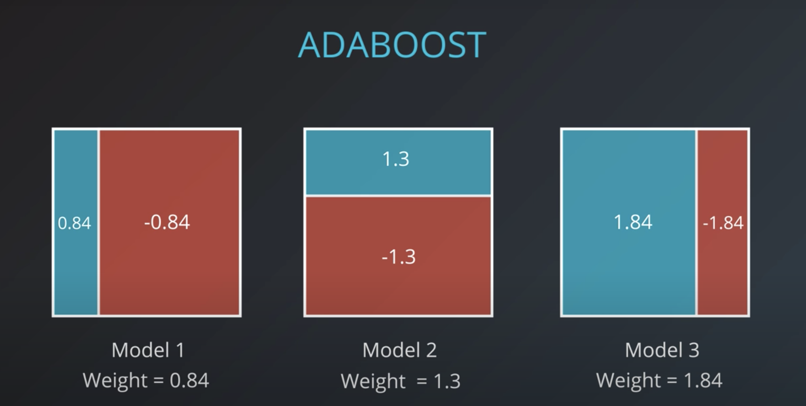
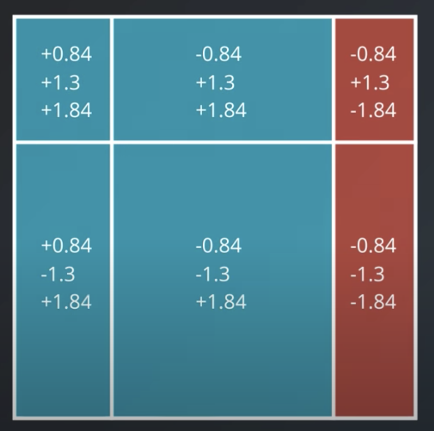
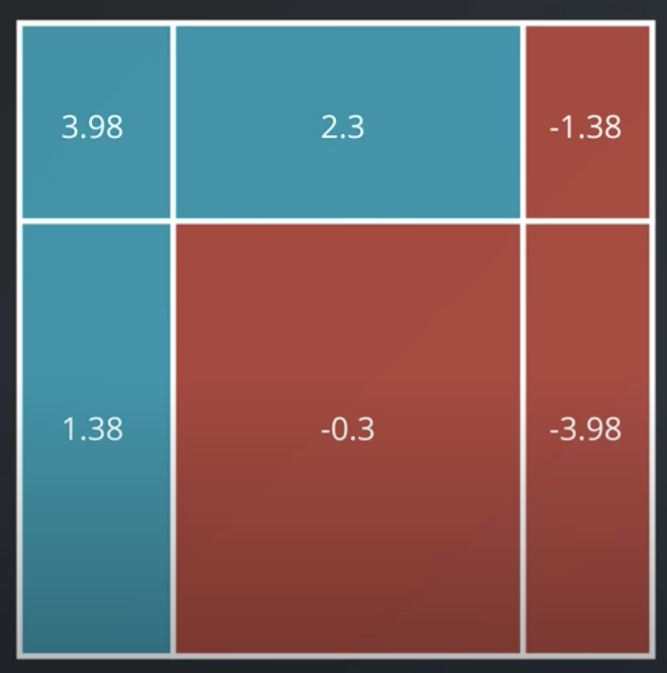

# Ensemble Methods

## 1. Intro

* Most common ensemble methods:
    - **Bagging**: Bootstrap aggregating. Averaging or voting across models.
    - **Boosting**: Using each model for its strength

* Individual models are called **weak learners**, and resulting ensemble method the **strong learner**

* Weak learners don't need to be very good; they just need to be slightly better than random

## 2. Ensembles

* Common weak learner is a decision tree

* **Bias**: error in which the model misses relevant relations in the data. Leads to underfitting. (Linear regression has high bias.)

* **Variance**: error from sensitivity to small fluctuations in the training set. Leads to overfitting. (Decision tree has high variance.)

* Common to introduce randomness into high variance algorithms prior to making ensemble. Two common ways to do this, which are both used in random forests:
    - **Bootstrapping**: sampling data with replacement and fitting algorithm to sample data
    - **Subsetting the features**: only use subset of features for each decision tree

## 3. Random Forests

* Decision trees overfit

* **Random forests** algorithm:
    1. Pick a subset of features, and build a decision tree
    2. Repeat step 1 _n_ times
    3. For each observation, run in all decision trees, and vote on solution

* There are better ways to pick features than randomly; we'll learn more later

## 4. Bagging

* **Bagging** algorithm:
    1. Build a weak module using subset of the data points
    2. Repeat step 1 _n_ times
    3. For each observation, run in all weak learners, and vote on solution

## 5. AdaBoost

* **Adaboost** is a boosting algorithm that iteratively creates weak models, putting increasing weight on misclassifications

## 6. Weighting the Data

* Algorithm:
    1. All data points start with equal weights
    2. Create the first weak model. Figure out correct and incorrect weights (e.g., 7 and 3)
    3. Adjust weights of misclassified points by multiplying them by ratio of correct-to-incorrect values (e.g., 1pt * 7/3 = 7/3 pts). Now the ration of correct to incorrect weights is even (e.g., 7 and 7)
    4. Repeat steps 1 - 3 _n_ times, each time creating a new weak learner

## 7. Weighting the Models 1

## 8. Weighting the Models 2

* We want to weight truthful models close to 1, models that are half truthful close to 0, and models that consistently lie close to -1 (which makes the models that lie useful)

* Here's how we'll weight models:
    ```
    weight = ln(x / (1-x))
    ```
    Where `x` is the accuracy

* Shortcut:
    ```
    weight = ln(# correct / # incorrect)
    ```

**Quiz**:


What's the weight for each?

```
weight₁ = ln((7/8)/(1/8))
        = log(7/1)/log(e)
        = 1.95

weight₂ = ln((4/8)/(4/8))
        = log(1)/log(e)
        = 0

weight₃ = ln((2/8)/(6/8))
        = log(2/6)/log(e)
        = -1.1
```

## 9. Weighting the Models 3

* If you have a weak learner that is 100% correct, its weight will be `∞`

* If you have a weak learner that is 100% incorrect, its weight will be `-∞`

* In practice, neither of these are likely

## 10. Combining the Models

Assign the weights of each model to the positive and negative areas:



Now create a new model:



After summing, when the value is positive we classify as blue, and when negative, we classify as red:



## 11. AdaBoost in sklearn

Usage:

```python
from sklearn.ensemble import AdaBoostClassifier
model = AdaBoostClassifier()
model.fit(x_train, y_train)
model.predict(x_test)
```

Most common hyperparameters:
* **base_estimator**: model utilized for the weak learners
* **n_estimators**: number of weak learners to use

E.g.,
```python
from sklearn.tree import DecisionTreeClassifier
model = AdaBoostClassifier(base_estimator = DecisionTreeClassifier(max_depth=2), n_estimators = 4)
```
