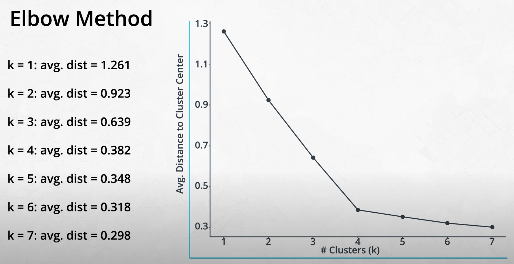

# Clustering

## 1. Introduction

## 2. Course Overview

## 3. Two Types of Unsupervised Learning

1. clustering
2. dimensionality reduction

## 4. K-Means Use Case

## 5. K-Means

* **k-means clustering**: clustering approach that groups data points into specified number different groups, utilizing randomly placed centroids

## 6. Identifying Clusters

## 7. Changing K

* In practice, changing K is a combination of art and science

## 8. Elbow Method

* **elbow method**: plotting the number of clusters K (x-axis) against the avg distance to cluster center (y-axis), and looking for the point where the decrease in distance becomes small
    

## 9. K-Means in Scikit Learn

```python
import sklearn.cluster.KMeans

kmeans_4 = KMeans(4)
model_4 = kmeans_4.fit(data) # alternatively, combine fit and predict w/ fit_predict
labels_4 = model_4.predict(data)
```

## 10. Your Turn

* To view docstring in notebook:
  ```python
  h.simulate_data?
  ```

* Making a **scree graph** (with 10 lines of code):
  ```python
  def score_k(n):
    k = KMeans(n)
    m = k.fit(data)
    return -m.score(data)

  centers = range(1,11)
  scores = list(map(score_k, centers))

  plt.plot(centers, scores, linestyle='--', marker='o', color='b');
  plt.xlabel('K');
  plt.ylabel('SSE');
  plt.title('SSE vs. K');
  ```

## 11. Solution

## 12. Video: How Does K-Means Work?

1. Place k centroids randomly
1. Repeat:
  1. Assign points to centroids by how close
  1. Move centroid to center of group

## 13. How Does K-Means Work?

## 14. Quiz: How Does K-Means Work?

## 15. Is That the Optimal Solution?

* The random initial starting points can impact performance; run many models to avoid local maxima

## 16. Feature Scaling

* Because uses distance, essential to use feature scaling; features with larger distances will otherwise dominate

## 17. Feature Scaling Example

## 18. Feature Scaling Solution

## 19. Feature Scaling

* **sklearn.preprocessing.MinMaxScaler**: scaling data as percentage of maximum value.
  ```python
  import pandas as pd
  from sklearn.preprocessing import MinMaxScaler

  ndarray2 = MinMaxScaler().fit_transform(df1)
  df2 = pd.DataFrame(ndarray2)
  df2.columns = ['height', 'weight'] # re-add column names
  ```

* **sklearn.preprocessing.StandardScaler**: scaling data so it has mean 0 and variance 1.
  ```python
  import pandas as pd
  from sklearn.preprocessing import StandardScaler

  ndarray2 = StandardScaler().fit_transform(df1)
  df2 = pd.DataFrame(ndarray2)
  df2.columns = ['height', 'weight'] # re-add column names
  ```

## 20. Solution

## 21. Outro

## 22. Recap

* Remember these common pitfalls:
  1. Random placement of centroids may lead to non-optimal solutions.
    * Solution: run algorithm multiple times and select centroids with smallest average distance.
  1. Different data scales result in different groupings.
    * Solution: scale your features using Standardizing (mean 0, standard deviation of 1)
