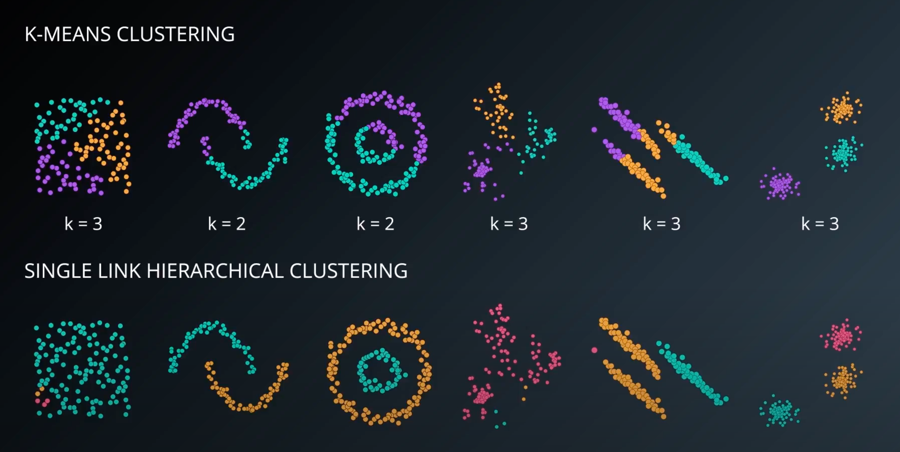
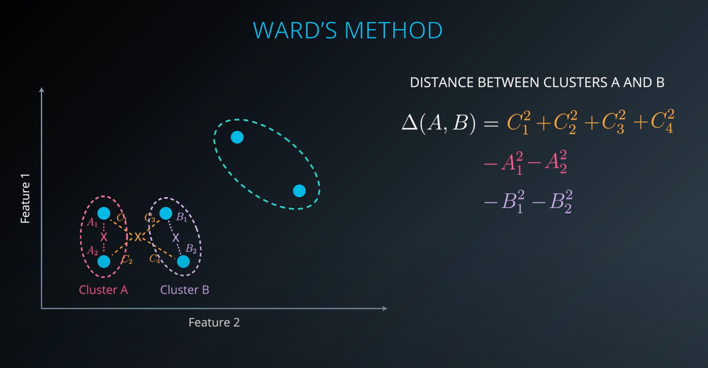
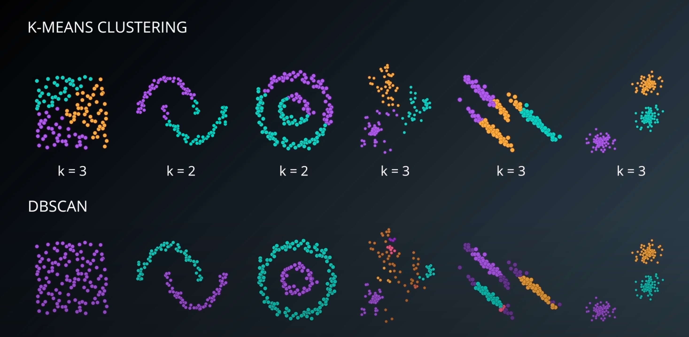
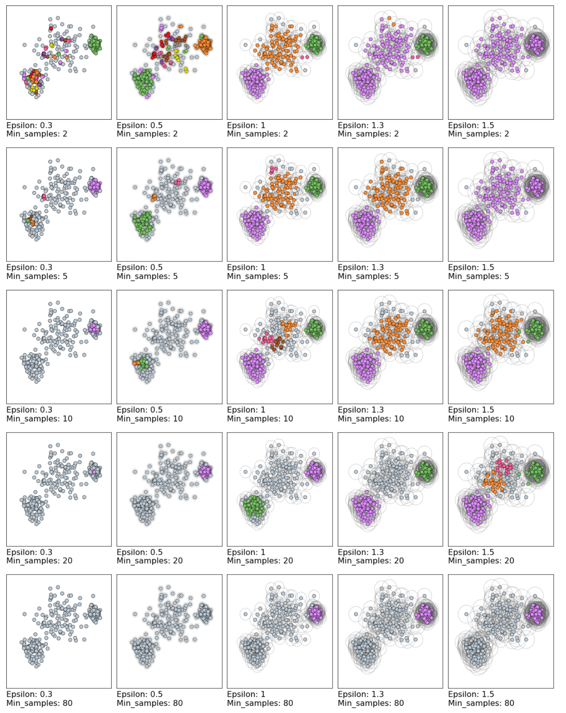

# Hierarchical and Density-Based Clustering

## 1. K-means considerations

* K-means is good at finding clusters of shape circle/sphere/hypersphere, but not other shapes

## 2. Overview of other clustering methods

## 3. Hierarchical clustering: single-link

* **single-link clustering** algorithm:
  1. Assume each point is a cluster
  1. Repeat until one cluster includes all points:
    1. Calculate distance between closest points in each cluster
    1. Group the two clusters that are closest

* Yields a tree
  - You can pick the number of clusters you care about, and separate the tree in number of desired clusters

* Pitfalls
  - Can yield elongated clusters that consume most of data points

## 4. Examining single-link clustering



* **dendrograms**: tree diagram, especially one showing taxonomic relationships

* Even when single-link hierarchical clusters don't work, its dendrograms yield useful insights:
  

## 5. Complete-link, average-link, Ward

* **agglomerative clustering**: assuming every data point is a cluster, building up clusters of clusters from ground up

* **complete link clustering**: like single-link clustering, but measures distances between furthest points in clusters (instead of nearest)
  - Produces compact structures

* **average link clustering**: like single-link clustering, but averages the distances between all the points in all of the clusters

* **Ward's method**: hierarchical clustering method that minimizes variance when clustering two clusters. default hierarchical clustering method in Scikit-Learn.
  

## 6. Hierarchical clustering implementation

* To cluster:
  ```python
  from sklearn import datasets, cluster

  X = datasets.load_iris().data[:10]

  clust = cluster.AgglomerativeClustering(n_clusters=3, linkage='ward')

  labels = clust.fit_predict(X)
  ```

* To cluster and produce dendrogram:
  ```python
  from scipy.cluster.hierarchy import dendrogram, ward, single
  from sklearn import datasets
  import matplotlib.pyplot as plt

  X = datasets.load_iris().data[:10]

  linkage_matrix = ward(X)

  dendrogram(linkage_matrix)

  plt.show()
  ```

## 7. [Lab] Hierarchical clustering

* Using `adjusted_rand_score` for external cluster validation
  - Values between -1 (low similarity) and 1 (two clusterings identical):
      ```python
      from sklearn.metrics import adjusted_rand_score

      score = adjusted_rand_score(iris.target, preds)
      ```

* Normalizing the dataset so values between 0 and 1:
  ```python
  from sklearn import preprocessing

  normalized_data = preprocessing.normalize(iris.data)
  ```

## 8. [Lab Solution] Hierarchical clustering

## 9. HC excamples and applications

* Advantages of hierarchical clustering:
  - hierarchical representation can be very informative
  - provides additional ability to visualize
  - especially useful when dataset contains hierarchical relationships (e.g., biology)
* Disadvantages of hierarchical clustering:
  - sensitive to noise and outliers
  - computationally intensive - O(N^2)

## 10. Quiz: Hierarchical clustering

## 11. DBSCAN

* **DBSCAN**: density-based clustering algorithm that can find clusters while labeling some points as noise and excluding from clusters, using maximum search distance and minimum cluster size

* DBSCAN looks at each point, and looks for another points within neighborhood. Parameters:
  - Epsilon: Search distance around point
  - MinPts: minimum number of points required to form a density cluster

* Any point with >= MinPts points within Epsilon distance is called a "core point", and everything that's part of a cluster but not a core point is a "border point"



## 12. DBSCAN implementation

```python
from sklearn import datasets, cluster

X = datasets.load_iris().data

db = cluster.DBSCAN(eps=0.5, min_samples=5)
db.fit_predict(X) # or use fit & predict
```

## 13. [Lab] DBSCAN

* DBSCAN clustering is sensitive to parameter selection:
  

## 14. [Lab Solution] DBSCAN

## 15. DBSCAN examples & applications

* DBSCAN advantages:
  - Don't need to specify number of clusters
  - Flexibility in shapes and sizes of clusters
  - Able to deal with noise and outliers
* DBSCAN disadvantages:
  - Border points reachable from two clusters selected based on execution order
  - Difficulty finding clusters with varying densities

* Applications of DBSCAN:
  - Analyzing network traffic
  - Analyzing temperature trends

## 16. Quiz: DBSCAN
