# Gaussian Mixture Models and Cluster Validation

## 1. Intro

* **soft clustering**: every data point belongs to every cluster, but with differing levels of membership

* GMMs assign points to clusters based on whether the seem to form a Gaussian model:
  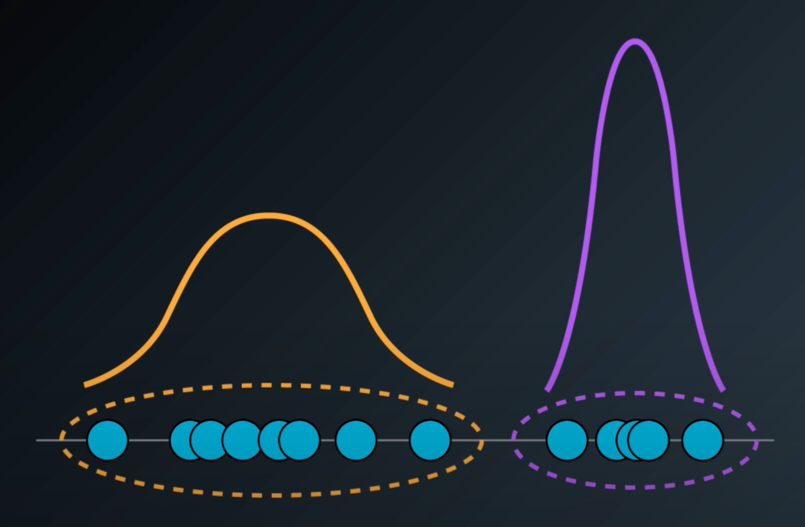

## 2. Gaussian Mixture Model (GMM)

* **Gaussian Mixture Model**: soft clustering technique using expectation-maximization algorithm that assumes clusters of data following statistical distributions

## 3. Gaussian Distribution in One Dimension

## 4. GMM Clustering in One Dimension

* GMM can find mixtures of Gaussian distributions -- hence the name:
  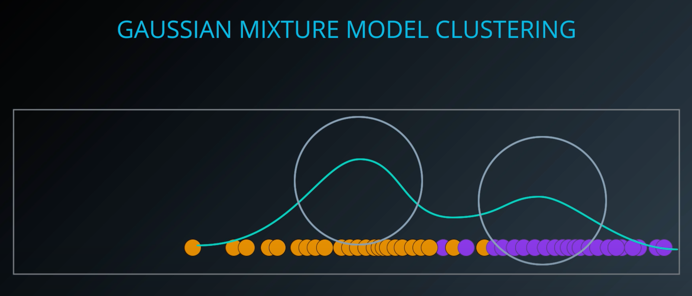

## 5. Gaussian Distribution in 2D

* **multivariate Gaussian distribution**: Gaussian distribution with multiple variables (composed of multiple distributions, one per dimension)

* GMMs in 2D identify multivariate Gaussian distributions:
  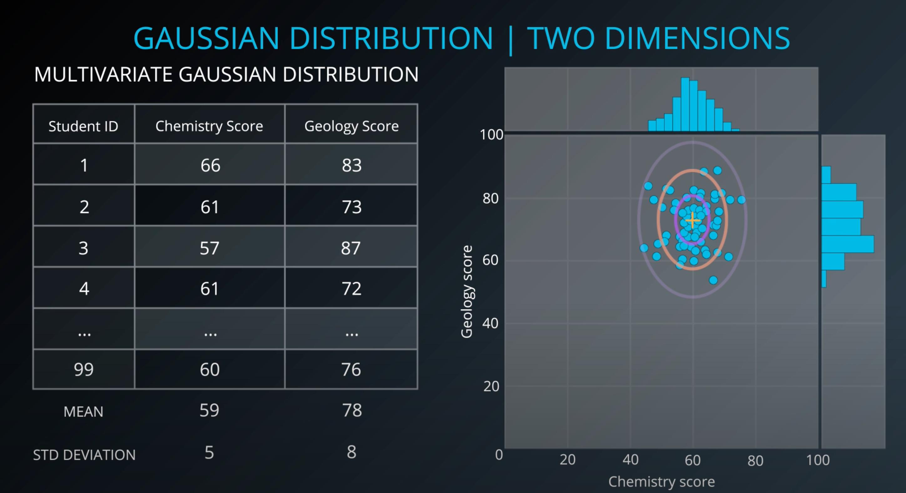

## 6. GMM in 2D

## 7. Quiz: Gaussian Mixtures

## 8. Overview of Expectation Maximization

* **expectation-maximization algorithm**:
  1. initialize K Gaussian distributions
  1. ("expectation step", or "e step") soft-cluster data
  1. ("maximization step", or "m step") re-estimate the Gaussians
  1. evaluate log-likelihood to check for convergence; else go to step 2

## 9. Expectation Maximization Part 1

* For assigning a point to a distribution during the expectation step, we use the probability density function of the normal distribution:
  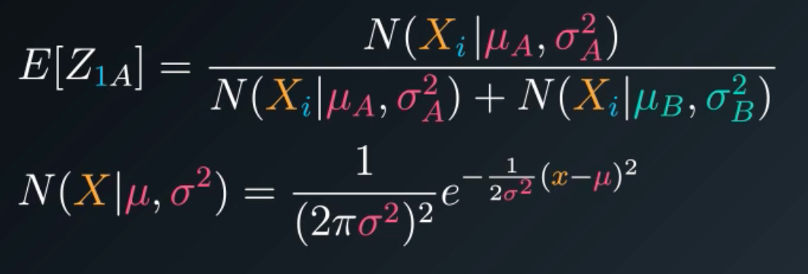

## 10. Expectation Maximization Part 2

* The maximization step involves calculating new mean and variance

* new mean is weighted average (including probability of membership) of all the points in cluster:
  

* new variance is also a weighted calculation:
  

* each expectation maximization step (until convergences) will move the clusters a little bit:
  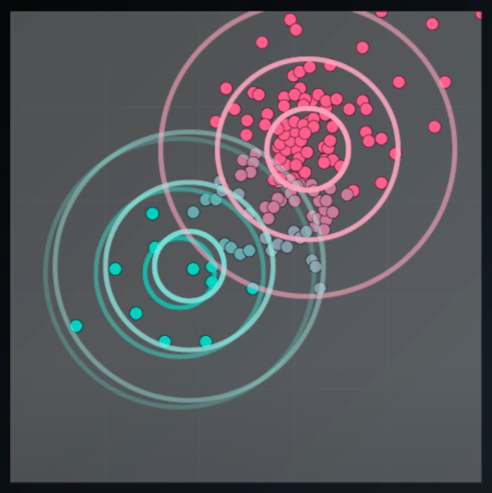

* evaluating the log-likelihood:
  

* **log-likelihood function**: function that produces values that indicate how likely our distributions produced observed data, which we want to maximize.  

* convergence happens when values barely increase between steps, or reaches maximize

## 11. Visual Example of EM Progress

* Model performance is sensitive to:
  - Initialization (e.g., manual)
  - Convariance type (e.g., spherical)

* Default Gaussian initialization for Scikit-Learn is k-means

* "Full" covariance allows ellipses and rotation

## 12. Quiz: Expectation Maximization

## 13. GMM Implementation

```python
from sklearn import datasets, mixture

X = datasets.load_iris().data[:10]

gmm = mixture.GaussianMixture(n_components=3)
gmm.fit(X)
clustering = gmm.predict(X) # E.g., [1 0 0 0 1 2 0 1 0 0]
```

## 14. GMM Examples & Applications

* GMM advantages:
  - soft-clustering (sample membership in multiple clusters)
  - cluster shape flexibility (e.g., clusters within clusters; ellipses)

* GMM disadvantages:
  - sensitive to initialization values
  - possible to converge to local optimum
  - slow convergence rate

* GMM applications:
  - identifying human routine activities (e.g., commuting, office work, lunch) based on accelerometer or GPS readings
  - identifying pulsars in astronomy data
  - biometrics (signatures, finger prints)
  - computer vision (e.g., identifying background vs foreground; even subtracting background)

## 15. Cluster Analysis Process

* The cluster analysis process:
  1. feature selection and **feature extraction** (transforming data to create novel or useful features)
  1. choose clustering algorithm (by experimentation), and select **proximity measurement**
  1. clustering validation (next several videos)
  1. results interpretation (domain expertise)

## 16. Cluster Validation

* Categories of cluster validation indices:
  - **external indices**: indices used for validating clusters with labeled data
  - **internal indices**: measure fit between data and clustering structure based on data itself
  - **relative indices**: measures which of clusters is better (all internal indices can be used for this purpose)

* 2 characteristics for comparing clusters: **compactness** (points are close together) and **separability** (clusters are further apart)  

## 17. External Validation Indices

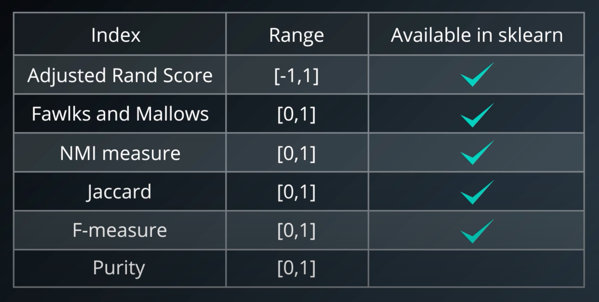

## 18. Quiz: Adjusted Rand Index

## 19. Internal Validation Indices

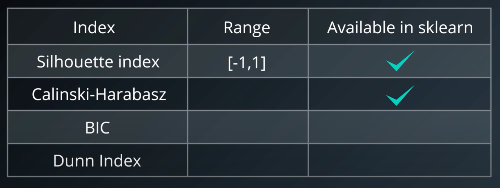

* **silhouette coefficient**: an internal validation technique yielding a value between -1 and 1, utilizing the average distance to samples in cluster as well as average distance to points in closest cluster
  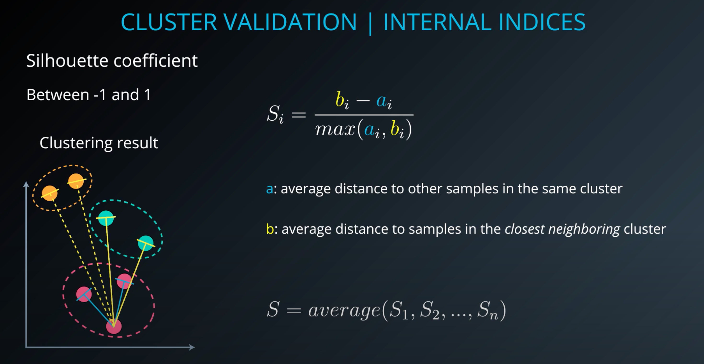

* Can use silhouette coefficient to find the correct number of clusters, K:
  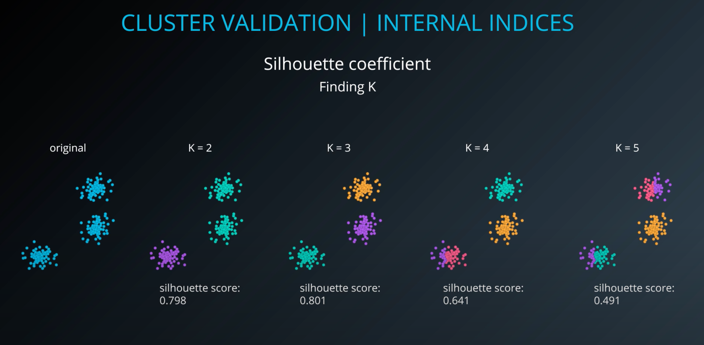
  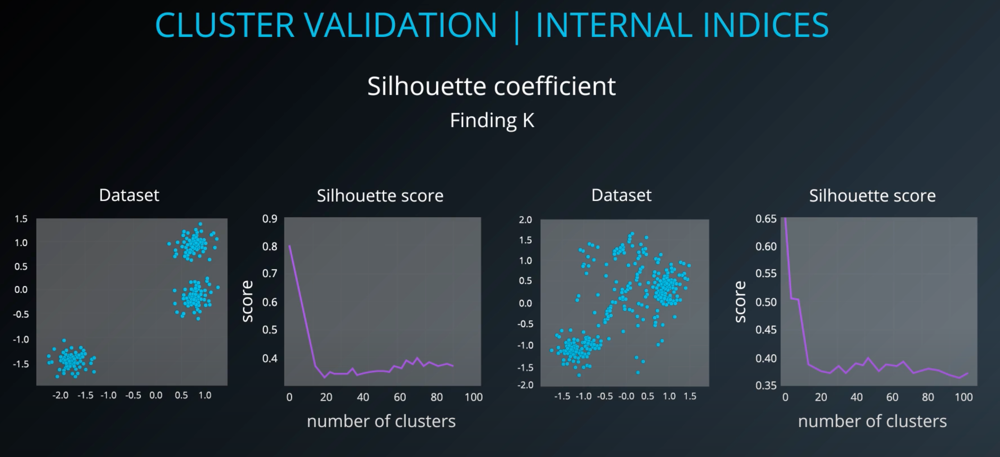

* Also use Silhouette coefficient to compare clustering algorithms:
  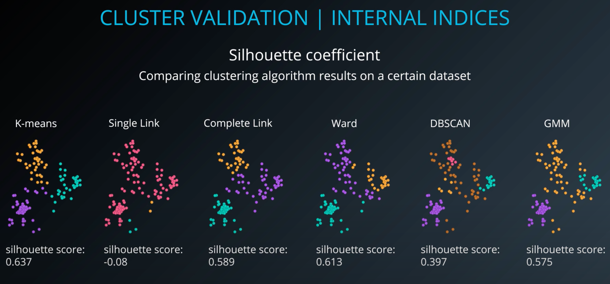

* Silhouette score has problems with DBSCAN (because of how it handles noise), and also problems with certain cluster shapes:
  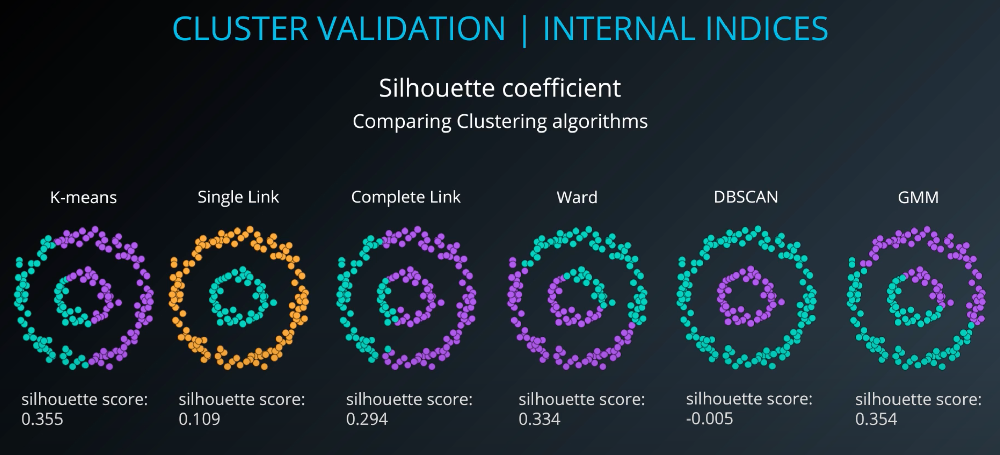

* For things like DBSCAN, want to use density-based clustering validation

## 20. Quiz: Silhouette Coefficient

## 21. GMM & Cluster Validation Lab

* Use sklearn's `make_blobs` function to create a dataset of Gaussian blobs

* **PairGrid**: plotting every pair of features against each other as subplots:
  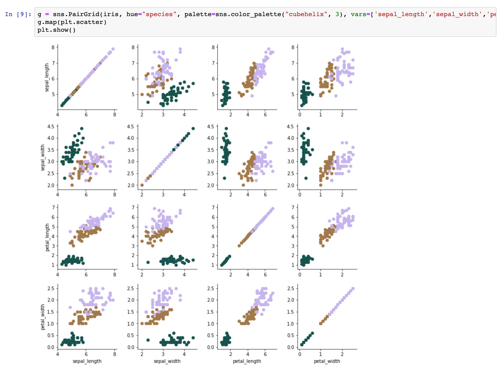

* Using adjusted Rand score from sklearn:
  ```python
  from sklearn.metrics ipmort adjusted_rand_score

  score = adjusted_rand_score(y, pred)
  ```

## 22. GMM & Cluster Validation Lab Solution
