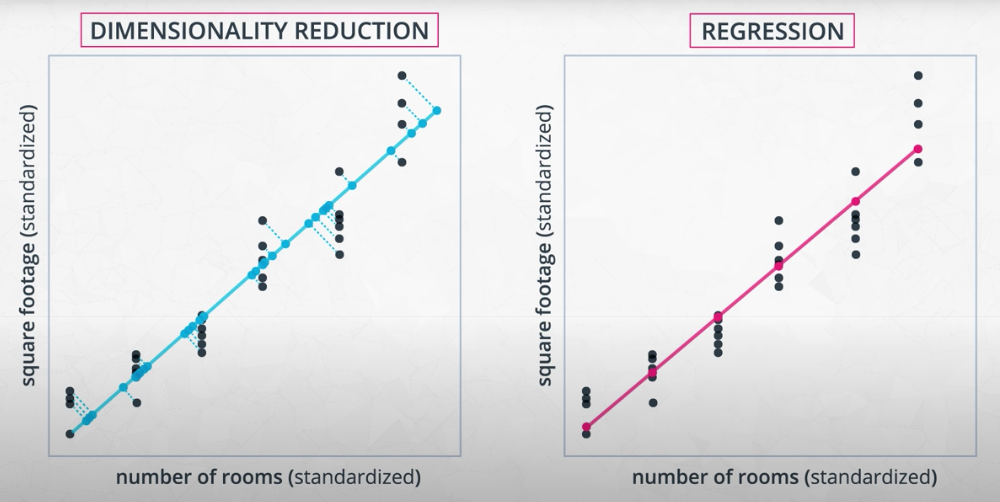
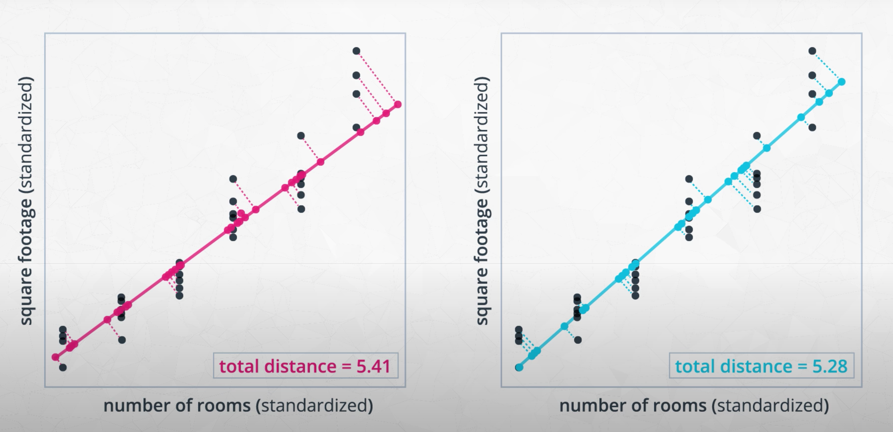
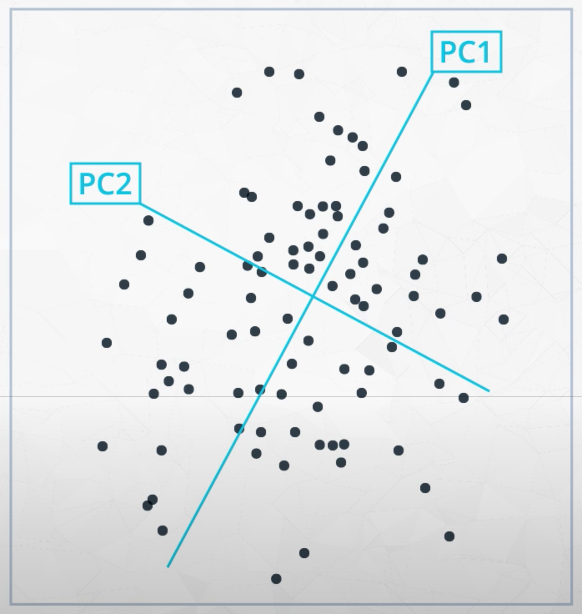

# Dimensionality Reduction and PCA

## 1. Video: Introduction

## 2. Video: Lesson Topics

## 3. Text: Lesson Topics

## 4. Video: Latent Features

* **latent feature**: features not directly observed, but underlies observed features (e.g. size of house, quality of neighborhood)

## 5. Latent Features

## 6. Video: How to Reduce Features?

* PCA helps with the "curse of dimensionality"

* **feature reduction** (identifying subset of data that is most useful) vs **feature extraction** (constructing new latent features from original dataset)

* Two types of feature reduction:
    - **filter methods**: discerning inherent correlations between feature data in unsupervised learning, or between features and output values in supervised learning. E.g., Pearson's Correlation, LDA, ANOVA.
    - **wrapper methods**: directly select features based on their impact on the model. computationally expensive. E.g., Forward Search, Backwards Search, Recursive Feature Elimination

* Three methods of feature extraction we'll cover:
    - Principal Component Analysis (PCA)
    - Independent Component Analysis (ICA)
    - Random Projection

## 7. Video: Dimensionality Reduction

* **principal components**: type of latent feature using linear combinations (projection onto lower dimensional space) of original features in order to retain most information in original data

* Dimensionality reduction looks a lot like regression, though they have very different aims:
    

## 8. Video: PCA Properties

* 1. Each component captures the largest amount of variance in the data:
    

* 2. Components must be orthogonal to each other
    

## 9. Quiz: How Does PCA Work?

## 10. Screencast: PCA

```python
def do_pca(n_components, data):
    X = StandardScaler().fit_transform(data)
    pca = PCA(n_components)
    X_pca = pca.fit_transform(X)
    return pca, X_pca
```

## 11. Notebook: PCA - Your Turn

## 12. Screencast: PCA Solution

## 13. Screencast: Interpret PCA Results

* `some_obj.<tab>` to see methods in object

## 14. Notebook: Interpretation

* **eigenvalue**: mathematical term for the amount of variance explained by each component in PCA.

* **eigenvectors**: mathematical term for the components (vector of weights) in PCA.

## 15. Screencast: Interpretation Solution

## 16. Text: What are EigenValues & EigenVectors?

## 17. Video: When to Use PCA?

## 18. Video: Recap

## 19. Notebook: Mini-Project

* To find number of components with minimum variance:
    ```python
    def do_pca(n_components, data):
        X = StandardScaler().fit_transform(data)
        pca = PCA(n_components)
        return pca, pca.fit_transform(X)

    def find_n_components_providing_variance(data, min_variance):
        max_n = len(data)
        for n in range(1, max_n):
            pca, _ = do_pca(n, data)
            variance = sum(pca.explained_variance_ratio_)
            if variance >= min_variance:
                return n, variance
        raise Exception(f"Couldn't find enough components with {min_variance} variance")

    n, variance = find_n_components_providing_variance(df, .85)
    ```

## 20. Mini-Project Solution

## 21. Video: Outro

## 22. Text: Recap
