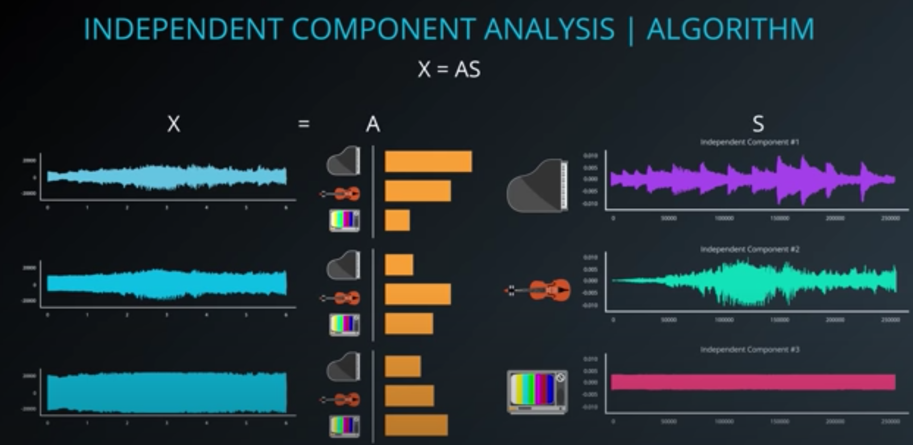
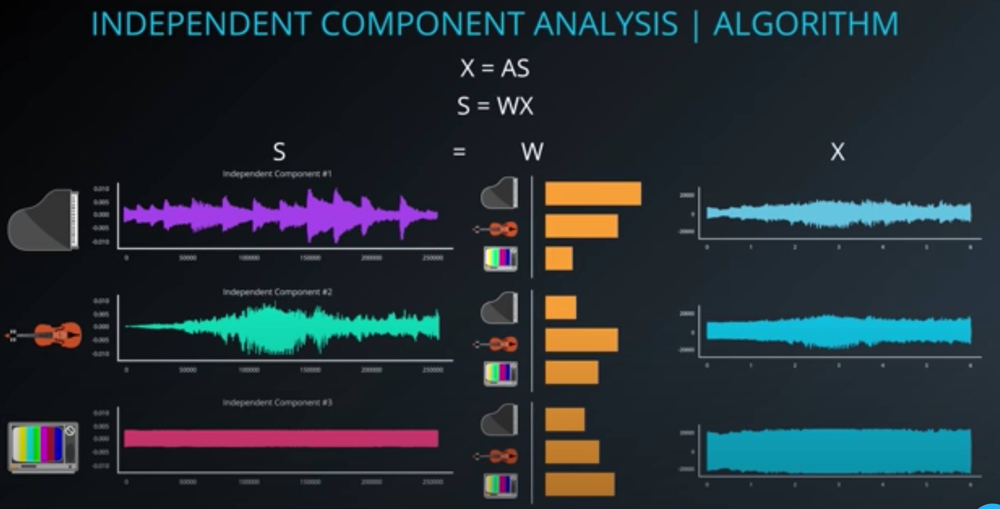
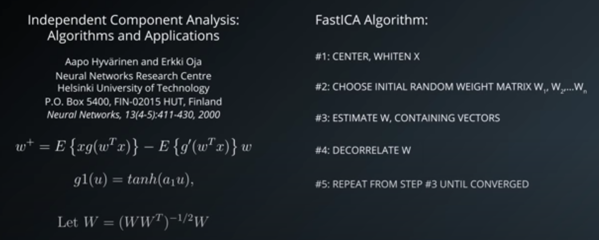

# Random Projection and ICA

## 1. Random Projection

* **Random Projection**: given acceptable loss of variance, generates an unspecified number of random lines (as opposed to picking lines that maximize variance, which is computationally expensive) to reduce a high dimensional space to a lower one

## 2. Quiz: Random Projection

## 3. Random Projection in sklearn

```python
from sklearn import random_projection

rp = random_projection.SparseRandomProjection() # can specify epsilon or k dimensions

new_X = rp.fit_transform(X)
```

## 4. Independent Component Analysis

* **blind source separation problem**: when multiple independent sources of data are combined together (e.g., hear a piano, cello, TV), and we want to separate them out.

* **Independent Component Analysis** (**ICA**): finds independent components in a dataset, addressing blind source separation problems. Requires as many signals (e.g., audio waveform) as components.

## 5. FastICA Algorithm

* FastICA algorithm:
    
    
    

* ICA assumptions:
    - components are statistically independent
    - components have non-Guassian distributions

* Good explanation: [Independent component analysis: algorithms and applications](http://citeseerx.ist.psu.edu/viewdoc/download?doi=10.1.1.322.679&rep=rep1&type=pdf)

## 6. Quiz: ICA

## 7. ICA in sklearn

```python
from sklearn.decomposition import FastICA

X = list(zip(signal_1, signal_2, signal_3)) # [(int, int, int)]

ica = FastICA(n_components=3)

components = ica.fit_transform(X)

component_1 = components[:,0]
component_2 = components[:,1]
component_3 = components[:,2]
```

## 8. [Lab] Independent Components Analysis

* Audio files are basically lists of floats

* Reading in wave files in Python:
    ```python
    import matplotlib.pyplot as plt
    import numpy as np
    import wave

    def plot_wav(signal, timing, title='Recording', color="#3ABFE7",
                y_min=-35000, y_max=35000):
        plt.figure(figsize=(12,2))
        plt.title(title)
        plt.plot(timing,signal, c=color)
        plt.ylim(-y_min, y_max)
        plt.show()

    # read in wav file
    mix_1_wave = wave.open('ICA mix 1.wav', 'r')

    mix_1_wave.getparams() # nchannels=1, sapwidth=2, framerate=44100, nframes=264515, etc

    # raw audio
    signal_1_raw = mix_1_wave.readframes(-1)
    signal_1 = np.fromstring(signal_1_raw, 'Int16') # nparray of length 264515

    # calc timing
    fs = mix_1_wave.getframerate()
    timing = np.linspace(0, len(signal_1)/fs, num=len(signal_1)

    # plot
    plot_wav(signal, timing, title='Recording 1')
    ```

* To create wave files from components:
    ```python
    from scipy.io import wavfile

    def write_component_to_wav(filename, framerate, result_signal, volume=100):
        # convert to int, map to range, and increase volume
        result_signal_int = np.int16(result_signal * 32767 * volume)
        wavefile.write(filename, framerate, result_signal_int)

    write_component_to_wav('result_signal_1.wav', fs, result_signal_1_int)
    # same for other 2 signals
    ```

## 9. [Solution] Independent Components Analysis

## 10. ICA Applications

* Some applications:
    - EEG scan data
    - Financial factor modeling (lecturer skeptical of this application)
