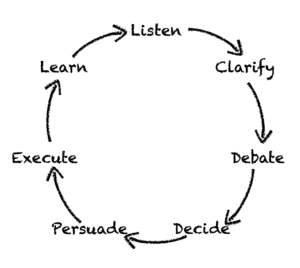

# Radical Candor

by Kim Scott

* **Radical Candor**: Care personally, challenge directly (9)
* Start by asking for criticism, not by giving it. (34)
* Superstar (steep growth) vs rock star (gradual growth) both need support. (44-7)
* Recognize & reward gradual growth, but don't promote. (53)
* Don't under-recognize your rock stars. (56)
* Companies often hire ppl for training whom they wouldn't have do the real work--this is a mistake. (57)
* There are no B-players. If you give person multiple opportunities (including feedback) but they don't perform, help them find an opportunity they can excel at. (64-5)
* Don't let a person's poor perf impact the rest of the team. If they are low performers & you've provided radical candor, fire them. (66-7)
* No permanent markers: superstars become rock stars and vice versa for legit personal reasons. (73-4)
* Telling people what to do doesn't work. Use the GSD wheel: (81)

* Listen in order to give the quite ones a voice. (82)
* Quiet vs loud listening. (83-6)
* Don't decide b/c the debate becomes painful, and separate debate vs decision making. (96)
* Encouraging debate: "Strong views held lightly"
* Block time for execution. (107)
* Practice work-life integration, not work-life balance. It isn't a zero-sum game; bring your whole self to work.
* Voluntarily give up unilateral authority and focus on building trust-based relationships. (118)
* Don't ever try to manage other people's emotions. (125)
* Praise in public, criticize in private; but you can be criticized anywhere, and there are advantages to encouraging it in public. (131)
* When soliciting feedback, embrace the discomfort. (132)
* Listen to criticism w/ the intent to understand, not respond; and reward criticism to get more of it. (133)
* If you get too much praise and not enough criticism, beware! (134)
* When giving feedback: **situation, behavior, impact** (137)
* Give feedback immediately; don't save it for 1-on-1 or performance review. (141-2)
* Fundamental attribution error: attributing something circumstantial to personality. Avoid "You are ______" feedback. (146)
* Don't say "don't take it personally". (147)
* Be careful when being radically candid w/ your boss; ask permission, start small, and know when to dust off your resume. (151-2)
* When you don't agree w/ your boss: **listen, challenge, commit** (153)
* **Abrasive trap**: women held back in career b/c men and women expect them to be less direct. (155)
* There should be no surprises during formal reviews. (162)
* Solicit feedback on yourself before giving others formal reviews in order to make it a two-way conversation. (162)
* During reviews, spend ~25 min looking back and ~25 min looking forward, and save rating/compensation for later. (164)
* Don't let team repeatedly complain (backstab) to you about someone; encourage radical candor. (165)
* Apple's "measure twice, cut once" vs Google's "launch and iterate" ethos. (166)
* Skip level meetings (167)
* Biggest bang for buck is spending time w/ the people doing best work. (174)
* Career conversations: life story (177), dreams (179), 18-mo plan (181)
* Assess your employees and come up w/ growth plans. (183)
* Hiring is subjective; put together a diverse hiring committee. (187)
* When hiring, bias towards no; unless dying to hire a person, don't make an offer. (189)
* Don't send out email about promotions; breeds unhealthy emphasis on status/title. (195) Should be rewarding people for the good work they do, not the status they've achieved. (196)
* Thank you notes go beyond praise; thank you notes express personal gratitude.
* The report should set the 1-on-1 agenda. (203)
* Use 1-on-1s as chance to nurture ideas before they are submitted to debate; help clarify.
* Delegate debates & decisions. Announce if you are retaining veto power, and wield it carefully. (209)
* Debate meetings are for debating, not deciding.
* If just measure results, won't know why (or who's) succeeding or failing. Measure activities, too. (217-8)
* When operationalizing Radical Candor, start w/ building trust: (229)
  1. Getting & giving advice
  1. Knowing your direct reports
  1. Good 1-on-1s (229)
* Four things you can do:
  1. Impromptu guidance
  1. Make back-stabbing impossible
  1. Make it easier to speak truth to power
  1. Put your own oxygen mask on first (take care of yourself)
* If you aren't reaching someone who's underperforming, make sure you've done all you can:

| Guidance = | Praise | Criticism |
|----------- | ------ | --------- |
| Give       | ✓ | ✓ |
| Get        | ✓ | ✓ |
| Encourage  | ✓ | ✓ |
